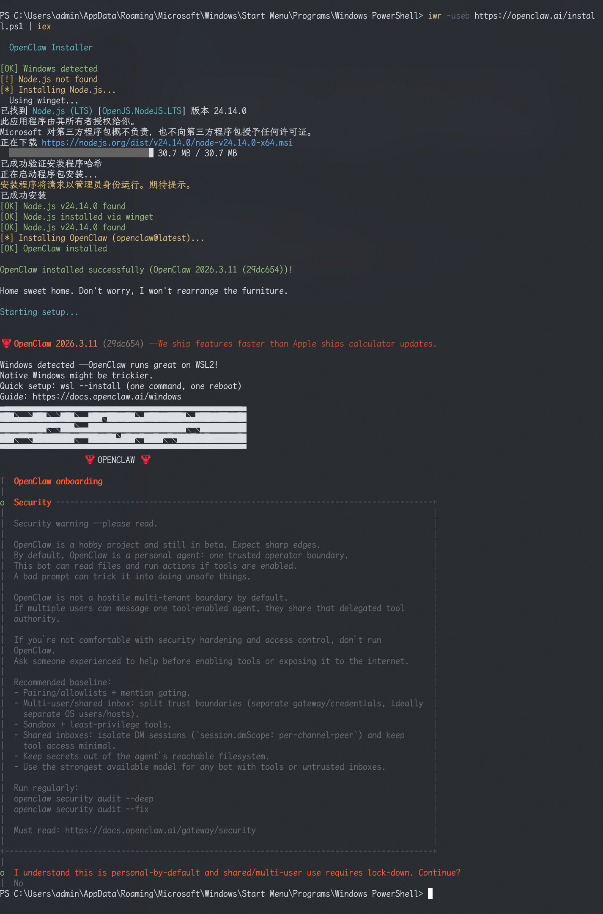

# 简介
本文介绍openclaw的概念，配置方式，应用场景，Token使用问题，使用教程等方面。

# Openclaw

## 传统的Chat AI

OpenClaw本身并不是什么神秘的新一代大语言模型，它没有超越GPT-5或者gemini3的智商。它本质是一个可以部署在本地电脑的开源智能体平台，之所以能引发如此巨大的热度，原因在于它打破了现在AI大模型只能长文本聊天的模式。
以前我们用AI，是打开一个聊天框，输入问题，得到答案，关闭它，这个AI的上下文就随之死亡了。而OpenClaw在于常驻与接管。能直接接入了你高频使用的聊天工具和办公软件。不需要切换App，就像给同事发微信一样给它发指令。它在本地拥有持久化的记忆文件，被赋予了系统权限，可以直接调用你的终端，读取你的本地文件。相当于你的一个24小时待命的助手。

## 配置方式

下面介绍windows上的openclaw安装方式：
1. 快捷键Ctrl+R打开运行
2. 输入powershell，弹出windows powershell命令行
3. 进入合适的目录
4. 安装openclaw: `iwr -useb https://openclaw.ai/install.ps1 | iex`
5. 第三步可能会弹出windows权限提醒，点击`是`即可
6. 等待第三步命令执行完毕，执行日志截图:
    

Openclaw安装
https://www.runoob.com/ai-agent/openclaw-feishu.html

飞书接入方式：
https://blog.eimoon.com/p/openclaw-feishu-integration-tutorial/

hooks使用
https://popring.cn/blog/claude-md-skills-mcp-hooks-guide

网关1006错误fix issue：
https://github.com/openclaw/openclaw/issues/7976

# 方式 1：自动打开浏览器
openclaw dashboard

# 方式 2：仅输出 URL，手动复制到浏览器
openclaw dashboard --no-open