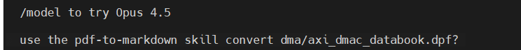

# SKILL学习链接

https://claude.com/blog/skills-explained

# 文章概要

可以接受这个网页，且结合该网页的官方内容+Claude Skills 实操安装的权威信息，为你整合出**官方标准的 Claude Skills 安装、启用、使用全流程**，覆盖Claude.ai（网页版）、Claude Code（本地/CLI）两大核心场景，同时补充技能创建、验证的关键细节，内容完全匹配你提供的官方文档定义：

# Claude Skills 官方完整安装&使用指南（基于claude.com/blog/skills-explained）
Skills 是 Claude 生态中**可复用的流程化知识包**（含指令、脚本、资源），采用**渐进式加载**（先加载元数据，需用时再加载完整内容），能让 Claude 稳定实现特定领域的专业化操作，以下是分场景的官方标准安装步骤，**先开启功能再安装**是所有操作的前提。

## 前置必做：开启 Skills 核心功能
无论哪个场景，先在 Claude 中启用 Skills 及配套能力，否则后续操作均不生效：
1. 进入 Claude 任意界面 → 打开**Settings（设置）** → 找到**Capabilities（功能）**/**Features（特性）**；
2. 开启**Skills**、**Code execution（代码执行）**、**File creation（文件创建）** 三个选项；
3. 保存设置并刷新页面，功能立即生效。

## 场景1：Claude.ai（网页版，付费计划可用）
网页版为**可视化上传安装**，操作简单，适合非开发人员/快速使用场景，完全匹配官方文档的入门要求：
### 安装步骤
1. 准备 Skills 包：Skills 是**文件夹格式**（核心含`SKILL.md`，可含脚本/资源），若为下载的技能包，需保证是**完整文件夹**（如需传输可打包为ZIP，上传时直接拖拽ZIP即可）；
2. 进入 Claude.ai → **Settings** → **Capabilities** → 找到**Skills**模块；
3. 点击**Upload Skill（上传技能）**，或直接将 Skills 文件夹/ZIP**拖拽**到指定区域；
4. 上传完成后，Claude 会自动扫描技能元数据并完成加载，在 Skills 列表中可看到已安装的技能。

### 快速使用
在对话中**直接描述需求/提及技能名**，Claude 会自动匹配并调用对应 Skills，例如：
- `Use the PDF skill to extract tables from this file`
- `按照品牌规范Skill生成一份产品介绍PPT`

## 场景2：Claude Code（本地/CLI，开发者推荐）
Claude Code 支持**插件市场安装**/**Git 克隆安装**两种方式，可实现**全局生效**（所有项目可用）或**项目内生效**（仅当前项目），是官方文档推荐的开发场景使用方式，以下是两种安装方法的完整步骤：

### 核心路径规则（官方标准）
- **全局生效**：将 Skills 放入`~/.claude/skills/`（所有Claude Code项目均可调用）；
- **项目内生效**：将 Skills 放入项目根目录的`./.claude/skills/`（仅当前项目可用，适合团队协作）。

### 方法1：Git 克隆安装（官方仓库优先，新手推荐）
Anthropic 官方维护了 Skills 仓库（含50+高质量可直接用的技能，格式最规范），克隆后可直接使用，也可作为自定义技能的模板：
1. 打开 Claude Code 终端/本地命令行，执行克隆命令：
   ```bash
   git clone https://github.com/anthropics/skills.git
   ```
2. 将克隆后的`skills`文件夹复制到**全局路径**或**项目内路径**：
   - 全局：`cp -r skills/* ~/.claude/skills/`
   - 项目内：`mkdir -p .claude/skills && cp -r skills/* ./.claude/skills/`
3. 无需额外操作，Claude Code 会**自动扫描并加载**Skills，立即生效。

### 方法2：插件市场安装（灵活安装单个/专属技能）
适合安装第三方/团队自定义的 Skills 插件，支持通过市场指令快速添加、安装、验证：
1. 打开 Claude Code 终端，添加插件市场源（以官方/第三方市场为例）：
   ```bash
   /plugin marketplace add 市场源地址（如anthropics/skills）
   ```
2. 安装指定 Skills 插件：
   ```bash
   /plugin install 技能名@市场源地址
   ```
3. 验证安装：执行`/plugin list`，终端会列出已安装的所有 Skills 插件，确认目标技能在列即安装成功。

### 快速使用
- 方式1：对话中描述需求，Claude 自动匹配（同网页版）；
- 方式2：使用**斜杠命令**直接调用（更高效），例如：
  ```bash
  /pdf extract-tables report.pdf  # 调用PDF技能提取表格
  /excel format-data data.xlsx    # 调用Excel技能格式化数据
  ```

## 场景3：API 开发人员（基于官方 Skills 接口）
若你是 API 开发者，需通过 Claude 官方**Skills 接口**实现集成，步骤如下（官方文档指引）：
1. 访问 Claude 官方开发者文档，找到**Skills endpoint（技能接口）**；
2. 参考官方**skills cookbook（技能开发手册）**，通过 API 实现 Skills 的加载、调用、管理；
3. 结合 MCP（模型上下文协议）实现 Skills 与外部工具（GDrive/GitHub/数据库）的联动，让 Skills 操作外部数据。

## 关键补充：自定义创建 Skills（官方标准结构）
若现有 Skills 无法满足需求，可按官方格式自定义，核心是**文件夹+SKILL.md**，`SKILL.md`为必须文件（含元数据+详细指令），脚本/资源为可选，官方标准结构如下：
```
自定义技能文件夹/
├── SKILL.md  # 核心文件：含技能元数据、操作指令、示例
├── scripts/  # 可选：可执行脚本（Python/Shell等）
├── assets/   # 可选：资源文件（模板/图片/配置等）
└── references/ # 可选：参考文档
```
`SKILL.md`需包含**Overview（概述）**、**核心规则/流程**、**使用示例**，参考官方文档中的`competitive-analysis`技能格式即可。

## 核心使用原则（匹配官方文档定义）
1. **Skills 与其他模块的配合**：
   - 与**Projects**配合：Projects 提供**背景知识/持久化上下文**，Skills 提供**操作方法**，是官方推荐的组合方式；
   - 与**MCP**配合：MCP 实现**外部工具/数据的连接**，Skills 实现**数据/工具的标准化操作**（MCP连数据，Skills教操作）；
   - 与**Subagents**配合：子代理（Subagents）可调用 Skills，让专业化子代理拥有标准化的操作能力（如代码审查子代理调用OWASP标准Skills）；
   - 与**Prompts**配合：Skills 提供**基础标准化指令**，Prompts 实现**单次需求的精细化调整**。
2. **渐进式加载特性**：Claude 会先加载 Skills 的元数据（约100tokens），仅当任务匹配时才加载完整指令（<5k tokens），脚本/资源仅需用时加载，不会占用过多上下文窗口。
3. **持久性**：Skills 安装后**跨对话生效**，无需在每次对话中重复输入指令，这是与 Prompts（仅单次对话生效）的核心区别。

## 常见问题排查
1. **Skills 不生效**：检查是否开启 Skills/Code execution 功能，确认 Skills 文件夹放入**官方标准路径**，刷新 Claude 后重试；
2. **调用无响应**：在对话中**明确提及技能名/核心需求**，让 Claude 能精准匹配 Skills 元数据；
3. **网页版无法上传**：确认 Skills 为**文件夹/ZIP格式**，非单个文件，且当前 Claude 为**付费计划**（网页版 Skills 仅付费可用）；
4. **Claude Code 无法扫描**：检查路径权限（保证`~/.claude/skills/`有读写权限），执行`/plugin reload`手动重新加载插件。

以上所有步骤均基于 Claude 官方文档（https://claude.com/blog/skills-explained）的标准定义，同时补充了实操安装的关键细节，确保与官方生态完全兼容。

https://code.claude.com/docs/zh-CN/plugin-marketplaces

## 安装方式 - 个人总结

### 离线安装
适合内网环境
下载链接
https://skillsmp.com/search?q=pdf2markdown

可以复制`~/.claude/`目录到claude当前workdspace下，然后把下载好的plugin zip文件解压到.claude/plugin目录下

再次打开claude可以输入plugin名称看到补全信息

比如我下载了pdf转markdown的skill，压缩后claude下可以找到这个skill，prompt为：



