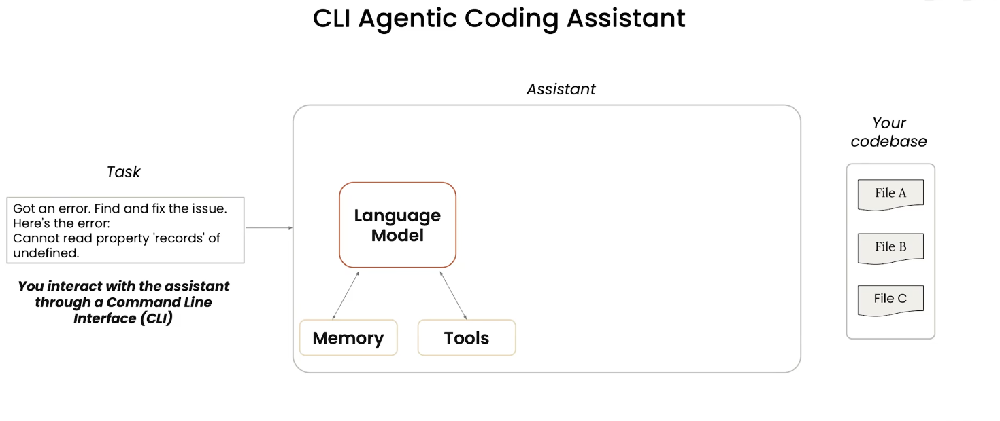
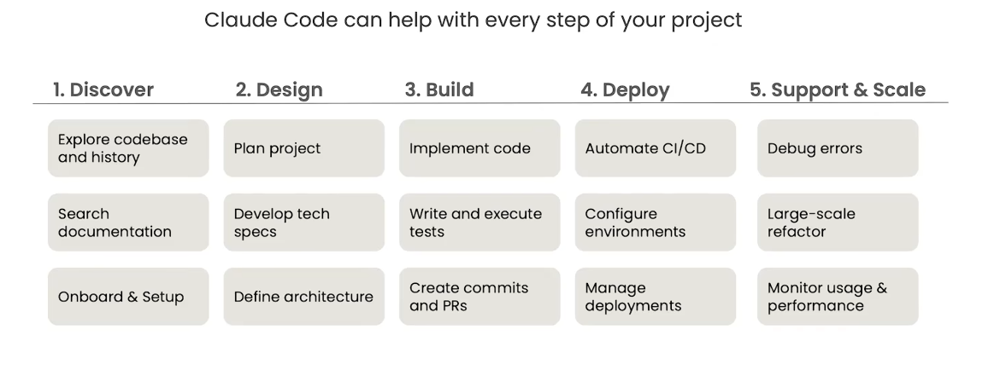
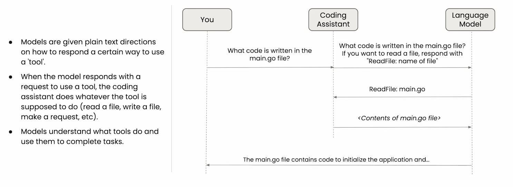
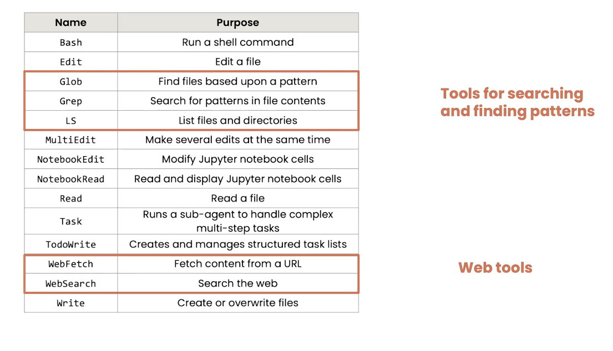
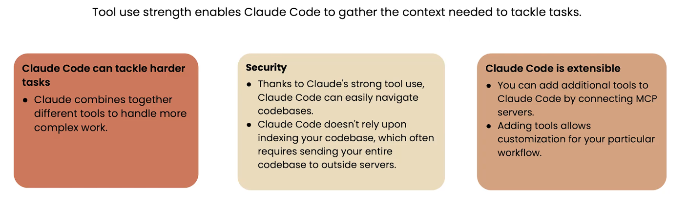
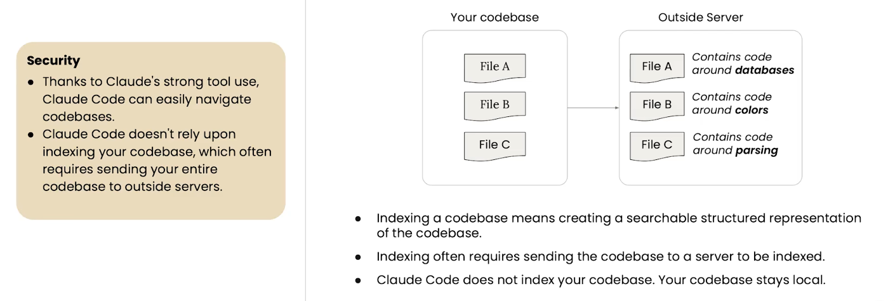
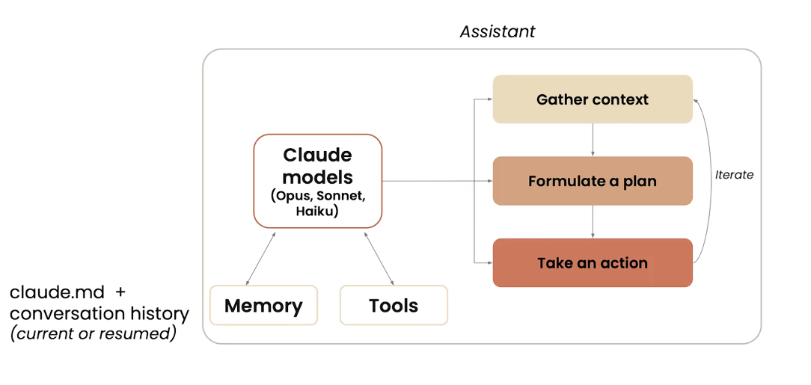
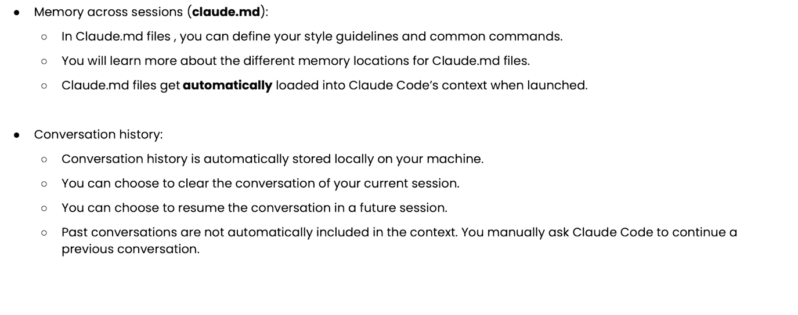

# what is claude code?

模型，为模型准备的memroy，tools框架，以及为模型提供的一个环境，让他能够确定数据，制定计划，并执行。

# function

# tools

读文件：

工具清单：

强大的工具使用：
优势，以及MCP服务器对工具的支持。工具可以自定义你特殊的工作流

## security
codebase保存在本地

# memory

