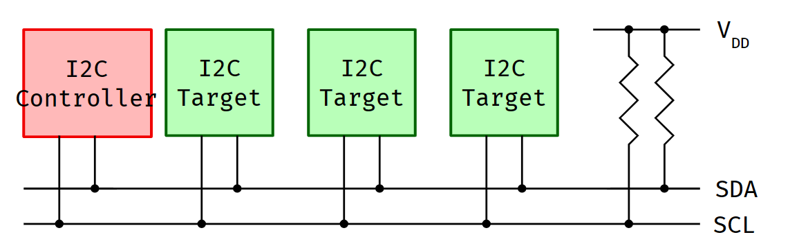
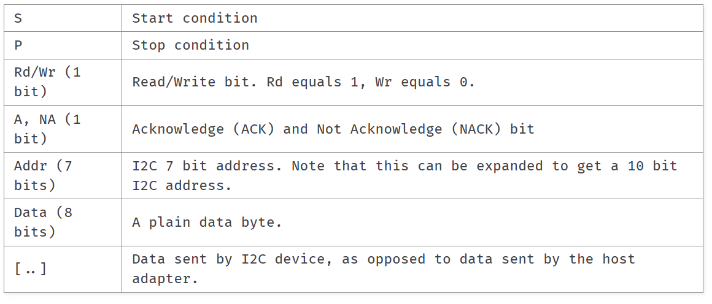
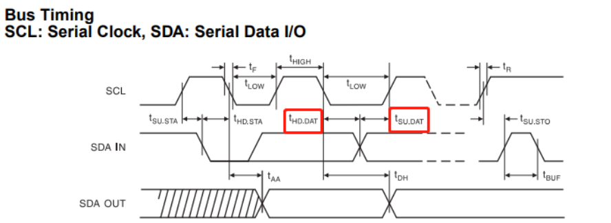
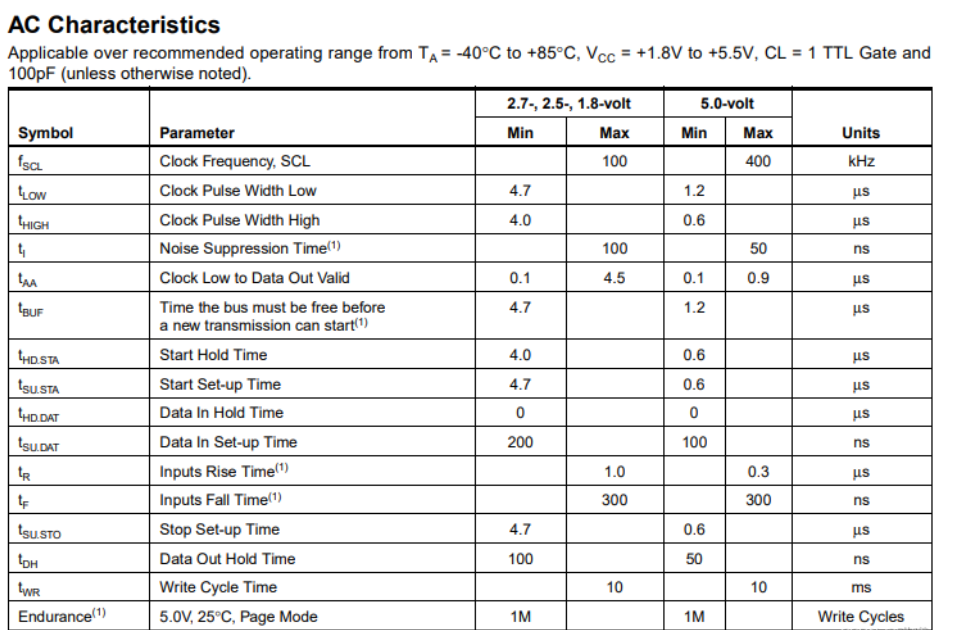

# 参考文档
官方标准文档
NXP（原飞利浦半导体）官方规范​
[I2C-bus specification and user manual](https://www.kernel.org/doc/html/latest/i2c/index.html)
UM10204 Rev. 7.0 — 这是最权威的官方技术手册

NXP I2C 资源中心​
[I2C-bus官方主页](https://www.nxp.com/design/design-center/interface-bus/i2c-bus/I2C-bus-resources:I2C-BUS)
包含规范、工具、应用笔记等完整资源

其他官方资源
[Raspberry Pi官方文档​](https://www.raspberrypi.com/documentation/computers/raspberry-pi.html#i2c)
I2C配置与使用
实用配置指南和示例

Linux内核文档​
[I2C子系统文档](https://www.kernel.org/doc/html/latest/i2c/index.html)
Linux驱动开发者的权威参考

[知乎](https://zhuanlan.zhihu.com/p/678229227)

# 简介
本文介绍与I2C相关的协议以及软硬件知识，包括：如何I2C协议详情，如何初始化I2C设备，与I2C设备通信，I2C总线的硬件设计，I2C驱动如何编写(裸机版本+Linux内核版本，GPIO软件实现版本，控制器抽象版本) ，linux内核I2C子系统框架。

# 介绍I2C(附带SMBus)

I²C（发音为“ I 平方 C”，在内核文档中写作 I2C）是由飞利浦公司开发的一种协议。它是一种**双线**协议，具有可变速度（通常最高可达 **400K赫兹**，高速模式下可达 **5M赫兹**）。它为连接多种**通信需求不频繁或带宽较低的设备**提供了一种**经济实惠**的总线。I²C 在嵌入式系统中得到了广泛应用。有些系统使用不符合品牌要求的变体，因此不被宣传为 I²C，而是采用不同的名称，例如 TWI（双线接口）、IIC。
截至撰写本文时，最新的官方 I2C 规范是恩智浦半导体发布的“ I²C 总线规范和用户手册”（UM10204），版本为 7。
SMBus（系统管理总线）基于 I2C 协议，**基本上是 I2C 协议和信号的一个子集**。许多 I2C 设备可以在 SMBus 上运行，但有些 SMBus 协议添加了超出实现 I2C 标识所需的意义。现代 PC 主板依赖于 SMBus。通过 SMBus 连接的最常见设备是使用 I2C EEPROM 进行配置的 RAM 模块和硬件监控芯片。
由于 SMBus 大部分是通用 I2C 总线的一个子集，因此我们可以在许多 I2C 系统上使用其协议。然而，有些系统无法同时满足 SMBus 和 I2C 的电气约束条件；还有一些系统无法实现所有常见的 SMBus 协议语义或消息。

# 工作原理
1. 开始和停止条件：通信由主设备通过在SDA线上生成特定的信号模式来开始和结束。
2. 地址帧：每次通信开始时，主设备发送一个地址帧来指定与之通信的从设备。
3. 7位或10位地址：每个I2C设备都有一个唯一的地址，允许在同一总线上连接多个设备。
4. 在多主模式下，当两个主设备同时尝试控制总线时，I2C协议包含仲裁机制以决定哪个设备获得控制权。
5. 主从通信：主设备控制时钟信号，向从设备发送或接收数据。
6. 应答位：每个字节后，接收方发送一个应答位（ACK）或非应答位（NACK），以告知发送方数据是否被成功接收。

# 术语

I2C总线连接一或多个主控芯片和一或多个目标芯片



**controller** chip是一个开始与目标设备进行通信的节点。在 Linux 内核实现中，它也被称为“适配器”或“总线”。控制器驱动程序通常位于 drivers/i2c/busses/ 子目录中。 

**algorithm** 包含了一段通用代码，该代码可用于实现整个一类的 I2C 控制器。每个具体的控制器驱动程序要么依赖于位于 drivers/i2c/algos/ 子目录中的算法驱动程序，要么包含其自身的实现。 

**target** chip是指在接收到指令时会响应通信操作的节点。目标设备。在 Linux 内核实现中，它也被称为“客户端”。虽然目标通常是由独立的外部芯片构成的，但 Linux 也可以充当目标（需要硬件支持）并响应总线上的另一个控制器。这被称为本地目标。相比之下，外部芯片被称为远程目标。 

Target drivers程序被存放在与它们所提供的功能相对应的特定目录中，例如，用于 GPIO 扩展器的驱动程序存放在“drivers/gpio/”目录下，用于视频相关芯片的驱动程序存放在“drivers/media/i2c/”目录下。 
对于上图所示的示例配置，您将需要一个驱动程序来处理该部分。 I2C 控制器以及适用于您 I2C 设备的驱动程序。通常每个设备对应一个驱动程序。

同义词 
如上所述，Linux 的 I2C 实现长期以来将控制器称为“适配器”，将目标设备称为“客户端”。许多数据结构在其名称中都使用了这些相同的术语。因此，在讨论实现细节时，您也应该了解这些术语。不过，官方的表述更为推荐。 

过时的术语 在早期的 I2C 规范中，控制器被称为“主设备”，而目标设备则被称为“从设备”。这些术语在第 7 版规范中已被淘汰，并且 Linux 内核行为准则也不再提倡使用这些术语。您仍可能会在未更新的文档引用中看到它们。然而，总体态度是使用包容性的术语：控制器和目标设备。在 Linux 内核中替换旧术语的工作仍在进行中。


# The I2C Protocol
介绍基础的I2C协议，以及内核下的API接口

## 关键时间/时序
I2C协议是同步协议，需要SCL时钟线来同步数据，每个SCL时钟的**高电平**采样SDA上的数据。
采样时刻：在SCL高电平期间（SCL = HIGH）采样SDA
采样窗口：SCL高电平的中间位置
建立时间：数据建立时间（SDA在SCL上升沿前）
保持时间：数据保持时间（SDA在SCL下降沿后）

开始条件：SCL为高时，SDA由高到低。
设备地址&读写位：开始条件发送完毕后，一般会跟一个8bit sequence的设备地址&读写位。设备地址一般由7bit/10bit的地址位 + 1bit的 R/W指示位组成。MSB先发，LSB后发，最后1bit发R/W指示位，0指示读，1指示写。
ACK/NAK：应答/非应答位，由当前的接受方来给出，ACK是SCL为高时，SDA被接收方拉低。NAK是SCL为高时，SDA没有被拉低。如何设备NAK，意味着它没有成功接收前一个序列，可能的原因：设备在忙，不理解接受的数据，不能再接受任何数据等。此时应该由主机决定如何继续后续操作
内部寄存器地址：从设备内存中包含各种信息或数据的位置。例如，ADXL345加速度计有一个独特的设备地址和额外的内部寄存器地址，用于X、Y和Z轴。 因此，如果我们首先想读取x轴的数据，我们需要发送设备地址，然后发送x轴的特定内部寄存器地址。这些地址可以从传感器的数据手册中找到。
数据传输序列：寻址序列发送后，发送/读取数据传输序列，要么来自控制器，要么来自目标设备。这取决于在读/写位选择的模式。
停止条件：SCL为高时，SDA由低到高。在数据完全发送之后，传输将以停止条件结束，当SDA线在SCL线高电平时从低变高。这就是I2C通信协议的工作原理。


## 关键符号



## 简单的发送事务
内核实现了i2c_master_send()接口

> S Addr Wr [A] Data [A] Data [A] ... [A] Data [A] P

## 简单的接收事务
内核实现了i2c_master_recv()接口

> S Addr Rd [A] [Data] A [Data] A ... A [Data] NA P

## 组合传输
内核实现了i2c_transfer()用于组合传输
它们与上述交易类似，但这里发送的不是停止条件P，而是启动条件S，并且交易会继续进行。一个示例是先读取一个字节，然后写入一个字节：

一个案例：读一个字节，然后写一个字节

> S Addr Rd [A] [Data] NA **S** Addr Wr [A] Data [A] P


## 修改的事务（特殊事务）
以下是这些I2C特殊事务的详细介绍和使用场景：

1. I2C_M_IGNORE_NAK

事务类型：忽略无应答事务

功能说明：
• 正常情况下，当从机返回NAK（无应答）时，主机会立即中断当前消息传输

• 设置此标志后，主机会将所有NAK视为ACK（应答），继续发送完整消息

使用场景：
• 诊断和调试：强制发送完整数据帧，即使从机不响应

• 广播模式：向多个从机发送相同数据，即使某些从机地址不存在

• 容错处理：在从机可能暂时不响应的系统中完成传输

• 时序测试：测试完整消息传输的时序而不受从机响应影响

代码示例：
```
struct i2c_msg msg = {
    .addr = slave_addr,
    .flags = I2C_M_WR | I2C_M_IGNORE_NAK,
    .len = data_len,
    .buf = data_buffer
};
```

2. I2C_M_NO_RD_ACK

事务类型：读操作无应答事务

功能说明：
• 在读取操作中，跳过主机的应答位（通常是最后一个字节后的ACK/NAK）

• 主机读取数据后不发送应答信号

使用场景：
• SMBus协议兼容：某些SMBus设备需要特殊的应答处理

• 特殊设备：需要主机读取后立即停止的设备

• 多字节读取优化：读取最后一个字节时不发送额外应答

• 旧设备兼容：与不符合标准I2C协议的设备通信

3. I2C_M_NOSTART

事务类型：无起始条件事务

功能说明：
• 在组合事务中，不在某些点生成起始条件（S）和地址字节

• 允许将多个消息组合成单个连续传输

典型序列：
```
// 不使用NOSTART：
S Addr Wr [A] Data1 [A] P
S Addr Rd [A] Data2 [A] P

// 使用NOSTART（第二个消息）：
S Addr Rd [A] Data1 [A] Data2 [A] P
```

使用场景：
• 数据缓冲合并：将多个内存缓冲区的数据合并为单个I2C传输

• 复合操作：实现读写组合操作（如先写寄存器地址，再读数据）

• EEPROM访问：写入地址后立即读取数据

• 传感器读取：写入命令寄存器后读取测量结果

• 高效传输：减少重复的起始条件和地址传输开销

重要警告：
• 不要在第一个消息上设置I2C_M_NOSTART，这会产生起始条件但没有地址，会干扰总线上其他设备

4. I2C_M_REV_DIR_ADDR

事务类型：方向标志反转事务

功能说明：
• 切换Rd/Wr方向标志位（地址字节的最低有效位）

• 允许以相反方向执行操作（如想写但发送读标志，或反之）

使用场景：
• 特殊协议设备：如某些I2C设备使用非常规的方向位定义

• SCCB协议：某些摄像头传感器使用的协议

• 兼容性适配：与非标准I2C实现通信

• 测试验证：测试设备对不同方向位的响应

• 寄存器访问：某些设备用方向位选择寄存器组

5. I2C_M_STOP

事务类型：强制停止条件事务

功能说明：
• 在消息后强制产生停止条件（P）

• 正常情况下，组合事务的消息之间不会产生停止条件

使用场景：
• SCCB协议：SCCB（串行摄像头控制总线）需要每个操作后有停止条件

• 设备复位：某些设备需要停止条件来复位内部状态机

• 总线释放：确保在消息后释放总线控制权

• 错误恢复：在错误条件后强制总线重置

• 时序要求：满足特定设备的时序要求

实际应用示例

传感器读取操作（常见模式）
```
// 1. 写入寄存器地址（无停止条件）
struct i2c_msg msg1 = {
    .addr = sensor_addr,
    .flags = I2C_M_WR,
    .len = 1,
    .buf = ®_addr
};

// 2. 从该地址读取数据（无起始条件）
struct i2c_msg msg2 = {
    .addr = sensor_addr,
    .flags = I2C_M_RD | I2C_M_NOSTART,
    .len = 2,
    .buf = data_buffer
};

SCCB协议实现
// SCCB需要每个消息后有停止条件
struct i2c_msg msg = {
    .addr = camera_addr,
    .flags = I2C_M_WR | I2C_M_STOP,
    .len = 2,
    .buf = {reg_addr, reg_value}
};
```

注意事项

1. 设备兼容性：这些特殊标志主要用于解决特定设备问题
2. 总线干扰：不当使用（如第一个消息用NOSTART）会干扰其他设备
3. 协议合规：标准I2C设备通常不需要这些标志
4. 调试工具：使用逻辑分析仪验证特殊事务的波形
5. 文档参考：仔细阅读设备数据手册，确认是否需要特殊事务

这些特殊事务为I2C总线提供了更大的灵活性，但应谨慎使用，只在必要时用于解决特定设备或协议的兼容性问题。

## 时序参数分析
在SCL高电平期间采样SDA，且采样点在SCL高电平的中间位置(采样窗口在SCL为高电平周期的中间点，避免边沿毛刺的影响。)。
**SCL为高电平时，要求数据稳定**；SCL为低电平时，允许数据改变；
因为任何真实电路都有延迟、上升下降时间、寄生电容：
- 信号不是瞬间变稳
- 接收器不是瞬间就能采样
- 总线有多个设备，电平变化需要时间

如果没有这两段 “保护时间”：
- 数据还在晃，时钟就采样 → 采样错误
- 时钟刚采完，数据立刻变 → 被误读成新数据

下面分析100K和400Khz下的参数的SDA建立时间和SDA保持时间
首先讲解建立时间和保持时间
I2C 是同步串行通信，靠 SCL（时钟） 和 SDA（数据） 配合采样。
① 建立时间  tSU—Setup Time
定义：
数据 SDA 必须在时钟 SCL 有效边沿到来之前，提前稳定好的时间。
通俗说：
    时钟跳变前，数据先站稳。
② 保持时间  tHD—Hold Time
定义：
时钟有效边沿过后，数据 SDA 必须继续保持稳定不变的时间。
通俗说：
    时钟跳变后，数据再多稳一会儿。

Hold Time可以是0，因为SCL下降沿之后，SDA就不需要稳定了(I2C协议是边沿触发采样，电平保持无关的)。
发送方：在 SCL 高电平期间保持 SDA 稳定（满足 t_SU:DAT和 t_HD:DAT的最大值约束）
接收方：在 SCL 高电平中间采样 SDA
SCL下降沿后：发送方可立即改变SDA，准备下一个比特或停止条件
注意：
t_HD:DAT的最大值（3.45μs）更重要 —— 它表示 SDA 不能太晚改变，否则可能影响下一个设备的采样（尤其在高速或长距离总线中）。最小值为 0 是为了兼容低速、简单设备，不代表推荐值为 0。






## Bus Clear
结合您表格中已有的SMBus Slave Case（Device ID、ARP、中断、读写），以及SMBus协议特有的规范（如超时机制、PEC校验、主机通知协议等），以下是针对SMBus测试的补充Case建议。这些Case旨在覆盖协议细节和边缘场景，提升测试覆盖率：

一、SMBus 协议特性专项Case

1. SMBus 超时（Timeout）机制验证

• Test Case ID：I2C_SMBUS_F0006

• Test Objective：验证SMBus设备在总线空闲超时（T_TIMEOUT）后是否自动复位状态机，避免总线死锁。

• Test Method：

  • 配置SMBus Slave为支持超时（通常SMBus要求时钟低电平最短10kHz，超时通常在25ms~35ms左右，需参考具体Slave规格）。

  • 主机发起一次事务后，故意不发送P信号（让总线进入空闲但未结束的状态），等待超时时间后，检查Slave是否回到初始状态（如地址可响应、状态寄存器清零）。

  • 再次发起事务，验证Slave能正常响应。

• Expected Result：超时后Slave状态机复位，可正常参与下一次事务。

2. PEC（Packet Error Checking）校验验证

• Test Case ID：I2C_SMBUS_F0007

• Test Objective：验证SMBus传输中PEC校验位的生成、传输和验证功能（SMBus可选但常见的特性，用于数据完整性检查）。

• Test Method：

  • 配置Slave支持PEC（需Slave硬件支持）。

  • 主机发起带PEC的SMBus事务（如Read Byte + PEC、Write Word + PEC）。

  • 主机端计算PEC并比较，或模拟PEC错误（如手动修改数据），检查Slave是否置位PEC错误状态位。

• Expected Result：PEC正确时事务成功；PEC错误时，Slave或主机检测到错误并置位相应标志。

3. SMBus 主机通知协议（Host Notify Protocol）验证

• Test Case ID：I2C_SMBUS_F0008

• Test Objective：验证SMBus Slave通过“主机通知”主动向主机发送事件通知（如电池电量低、温度异常）。

• Test Method：

  • 配置Slave支持主机通知（通常Slave会主动发起一个特殊的事务，格式为：S Addr(W) A Data A P，其中Data为通知的从机地址和数据）。

  • 主机监听总线，捕获Slave的通知事务，解析数据并验证是否符合预期。

• Expected Result：Slave成功发起主机通知事务，主机能正确接收并解析通知内容。

二、SMBus 读写场景扩展Case

4. SMBus Block Read/Write 验证

• Test Case ID：I2C_SMBUS_F0009（Block Read）、I2C_SMBUS_F0010（Block Write）

• Test Objective：验证SMBus的块传输（支持可变长度数据，需遵循SMBus块协议格式：首字节为数据长度，后续为数据）。

• Test Method：

  • 主机发起Block Write：发送数据长度 + 数据内容（如长度=3，数据为0x11,0x22,0x33）。

  • 主机发起Block Read：读取从机的块数据，验证长度和数据是否匹配。

• Expected Result：块传输的长度和数据一致，无截断或溢出。

5. SMBus 组合事务（Combined Transaction）验证

• Test Case ID：I2C_SMBUS_F0011

• Test Objective：验证SMBus的“组合事务”（如Send Byte + Read Byte，格式为 S Addr(W) A Command A Sr Addr(R) A Data P），用于快速读写同一设备的不同寄存器。

• Test Method：

  • 主机配置Slave为一个组合事务（如先写命令寄存器，再读状态寄存器）。

  • 发起组合事务，检查数据传输的连续性和正确性。

• Expected Result：组合事务的两次操作（写+读）原子性完成，数据正确。

三、SMBus 边缘场景与错误处理Case

6. SMBus 地址冲突与ARP重试验证

• Test Case ID：I2C_SMBUS_F0012

• Test Objective：验证SMBus ARP在地址冲突时的重试机制（参考SMBus ARP协议：主机会发送ARP请求，从机响应自己的地址；若冲突，主机会分配新地址）。

• Test Method：

  • 配置两个SMBus Slave（或模拟两个设备）在同一时刻响应ARP请求（地址冲突）。

  • 观察主机ARP流程：是否重新分配地址、Slave是否正确更新地址。

• Expected Result：ARP流程正确处理冲突，最终从机获得唯一地址。

7. SMBus 非法命令/数据长度验证

• Test Case ID：I2C_SMBUS_F0013

• Test Objective：验证Slave对非法命令（如不支持的SMBus命令码）或非法数据长度（如Block Read长度超过Slave最大支持长度）的响应。

• Test Method：

  • 主机发送不支持的SMBus命令（如SMBus命令码0x00，但Slave未实现）。

  • 主机发起Block Read，长度设为Slave最大支持长度+1。

  • 检查Slave是否置位错误标志（如命令错误、数据长度错误）。

• Expected Result：Slave检测到非法操作，置位相应错误状态，事务失败。

8. SMBus 时钟拉伸（Clock Stretching）验证

• Test Case ID：I2C_SMBUS_F0014

• Test Objective：验证SMBus Slave在忙时（如内部处理数据）通过时钟拉伸（拉低SCL）暂停主机传输的能力（SMBus允许时钟拉伸，但需注意超时机制）。

• Test Method：

  • 配置Slave在数据准备阶段拉伸SCL（如拉低SCL 10ms）。

  • 主机发起SMBus事务，检查是否能正确等待Slave释放SCL，并完成传输。

• Expected Result：主机检测到时钟拉伸，等待后继续传输，事务成功。

四、SMBus 与I2C兼容性验证Case

9. SMBus 设备与I2C主机的兼容性验证

• Test Case ID：I2C_SMBUS_F0015

• Test Objective：验证SMBus Slave能被标准I2C主机（非SMBus主机）正确访问，以及I2C设备能被SMBus主机访问（验证协议的互操作性）。

• Test Method：

  • 用SMBus主机访问I2C设备（如EEPROM），检查是否能正常读写。

  • 用I2C主机访问SMBus Slave（如PMU），检查是否能正常响应（需Slave兼容I2C协议）。

• Expected Result：跨协议访问时，事务基本成功（注意SMBus特有特性如PEC、超时可能不生效，但基础读写正常）。

五、SMBus 寄存器与中断增强Case

10. SMBus 状态寄存器全位验证

• Test Case ID：I2C_SMBUS_F0016

• Test Objective：验证SMBus Slave所有状态寄存器位（如错误标志、事务状态、PEC错误、超时标志等）的正确置位和清除。

• Test Method：

  • 通过寄存器遍历Case，逐个测试每个状态位的触发条件（如发送NACK、PEC错误、超时、Block传输完成等）。

  • 检查状态位是否按协议要求置位，清除操作是否有效。

• Expected Result：所有状态位在对应条件下正确置位/清除，无错漏。

11. SMBus 中断优先级与嵌套验证

• Test Case ID：I2C_SMBUS_F0017

• Test Objective：验证SMBus Slave的中断优先级和嵌套机制（若有多个中断源同时触发时，是否正确响应高优先级中断）。

• Test Method：

  • 配置Slave同时触发多个中断（如PEC错误 + 超时 + 事务完成）。

  • 检查中断服务程序是否按优先级处理，状态寄存器是否记录正确中断源。

• Expected Result：高优先级中断先被响应，状态寄存器正确记录所有中断源。

总结：新增Case的价值

• 协议覆盖更全面：覆盖了SMBus特有的超时、PEC、主机通知、块传输、组合事务等，确保Slave严格遵循SMBus规范。

• 边缘场景与错误处理：验证了地址冲突、非法命令、时钟拉伸、跨协议兼容性等，提升IP的鲁棒性。

• 状态与中断增强：细化了状态寄存器和中断的测试，确保驱动能正确识别和处理所有事件。

这些Case可作为您现有SMBus Case的补充，进一步提升FPGA原型验证的覆盖率和可靠性。
根据您提供的【链接内容】（即Linux内核官方文档关于I2C设备实例化的部分）以及您对Bus Clear功能的了解，并结合I2C控制器的通用硬件实现知识，以下是针对您问题的分析。

首先，需要明确的是，您提供的【链接内容】主要介绍了I2C设备在内核中的软件实例化方法，并未涉及Bus Clear功能的硬件实现细节、中断机制或软件交互流程。因此，以下回答将主要基于I2C/SMBus总线控制器硬件的通用设计原理。

1. 硬件如何检测总线挂死？

I2C控制器硬件实现Bus Clear功能，其检测机制通常依赖于超时计时器。具体实现逻辑如下：

•   检测对象：硬件会持续监控SCL和SDA两条信号线的电平状态。

•   检测条件：核心是检测总线是否长时间处于“忙”或“被拉低”的状态，且这个时间超出了协议或配置允许的正常范围。

•   常见检测场景：

    1.  时钟线（SCL）被拉低超时：某个Slave设备（或主机自身）因故障长时间将SCL线拉低（时钟拉伸过长），导致主机无法产生时钟进行后续通信。
    2.  数据线（SDA）被拉低超时：在非数据传输阶段，SDA线被意外拉低，使得总线无法进入空闲状态（SCL为高时，SDA也应为高）。
    3.  START与STOP之间超时：一次I2C事务（从START信号开始到STOP信号结束）的持续时间超过了预设的最大值。

•   硬件实现：控制器内部会集成一个或多个可编程的超时计数器。例如，SMBus协议明确规定了总线时钟低电平超时（T_LOW:SEXT）和总线空闲超时（T_TIMEOUT）。当硬件检测到上述异常状态持续时间超过配置的阈值时，就会触发一个内部标志，标志着“总线可能已挂死”，可以启动恢复流程。

2. 硬件实现了，软件就无需管理吗？

不完全正确。硬件实现了检测和恢复的“能力”，但软件的“管理”和“配置”至关重要。

•   硬件负责：实时监控信号线、计时、在超时发生时自动执行Bus Clear的物理操作（发送9个时钟脉冲、尝试产生STOP）。

•   软件（驱动）负责：

    1.  初始配置：软件需要在上电初始化时，配置Bus Clear功能的使能位、设置超时阈值等寄存器。
    2.  策略选择：软件可以决定是让硬件自动触发Bus Clear，还是仅在软件干预下手动触发。这通常由配置寄存器控制。
    3.  事后处理：Bus Clear执行后，无论成功与否，软件都需要被通知，并执行相应的错误处理、状态清理和可能的重试逻辑。软件不能完全“置身事外”。

3. 软件如何被通知锁死状态到来了？

软件主要通过两种机制感知总线异常和Bus Clear事件：中断 和 状态寄存器轮询。其中，中断是更高效、更常见的方式。

1.  中断通知（主流方式）：
    ◦   当硬件检测到总线超时并触发Bus Clear流程时，或当Bus Clear流程执行完毕后，I2C控制器通常会生成一个中断信号给CPU。

    ◦   该中断可能对应一个特定的“总线错误中断”或“仲裁丢失/超时中断”。驱动的中断服务程序（ISR）被调用后，会去读取控制器的状态寄存器以确认具体原因。

2.  状态寄存器轮询：
    ◦   软件也可以定期（或在每次传输前）主动读取控制器的状态寄存器，检查“总线忙超时”、“仲裁丢失”、“总线错误”等标志位是否被置位。这种方式效率较低，通常用于简单的系统或调试。

4. 软件交互流程：配置、执行与感知

您描述的流程基本正确，但更完整和典型的工作流程如下：

软件配置 -> 硬件监控 -> 事件发生 -> 硬件响应 -> 通知软件 -> 软件处理


1.  初始化与配置：软件在驱动初始化阶段，配置I2C控制器：
    ◦   使能Bus Clear功能（例如，设置 BCEN 位）。

    ◦   配置总线超时时间（例如，写入 TIMEOUT 寄存器）。

    ◦   使能相应的中断（例如，使能“总线错误中断”）。

    ◦   将中断服务程序（ISR）注册到系统。

2.  死锁发生与硬件自动处理：
    ◦   当总线因故挂死，且持续时间超过配置的阈值时，硬件自动检测到超时事件。

    ◦   硬件自动启动内置的Bus Clear恢复序列：接管SCL为输出，发送9个时钟脉冲，尝试产生STOP。

    ◦   硬件自动将状态寄存器中的“总线超时”或“Bus Clear完成”标志位置1。

    ◦   硬件自动断言中断信号线（如果已使能），通知CPU。

3.  软件感知与处理：
    ◦   CPU跳转到预先注册的I2C中断服务程序（ISR）。

    ◦   ISR读取状态寄存器，确认是“总线超时”或“Bus Clear”事件。

    ◦   ISR进行必要的清理工作：清除中断标志，可能还会重置控制器的内部状态机，或尝试重新初始化通信。

    ◦   ISR可能会通知上层的驱动逻辑或应用层：上一次传输因总线错误失败，需要决定是重试、记录日志还是上报错误。

总结：
一个集成了Bus Clear功能的现代I2C控制器，其理想协作模式是：软件负责“使能”和“配置”，硬件负责“实时检测”和“自动执行”恢复动作，最后通过“中断”高效地“通知”软件进行后续处理。 软件并非无需管理，而是从繁重的实时监控和位操作中解放出来，专注于配置和策略性的错误恢复。