# 简介

本文主要是针对新思的I2C控制器的学习，翻译。

本文涉及：
chapter1，2，3。主要包括协议部分，操作模式以及编程方式，特性介绍，Timing参数以及计算方式，clocks&resets，DMA接口，控制器主要信号介绍。

# Synopsys DW_apb_i2c 

## General Product Description

支持以下Features：

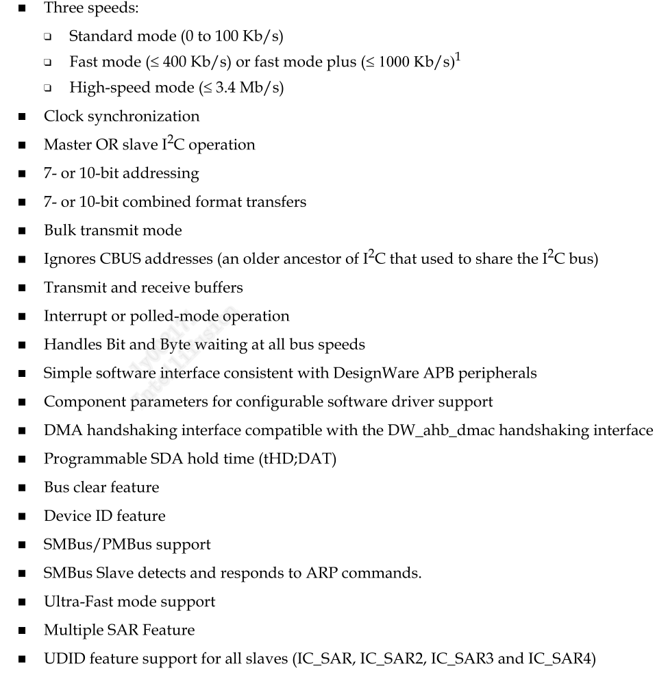

大多数的features都比较boring，我们来看这几个有趣的：
1. Clock synchronization
时钟同步机制，用于多主机环境下，当多个主机同时驱动 SCL 时，控制器能自动同步时钟相位，避免冲突，保证总线稳定。

2. Bulk transmit mode
批量传输模式，允许控制器连续发送多个数据字节，无需软件逐字节干预，大幅提升大数据块传输效率，减少 CPU 占用。

3. Handles Bit and Byte waiting at all bus speeds
在所有总线速率下，都能正确处理位等待和字节等待，兼容**从机的时钟拉伸（Clock Stretching）**和 ACK/NACK 响应，保证协议合规。

4. Programmable SDA hold time (tHD;DAT)
SDA 数据保持时间（tHD;DAT）可通过软件编程配置，用于适配不同从机的时序要求，提升总线兼容性，尤其在长走线或负载较重的场景下。

5. Bus clear feature
总线清除功能。当总线因异常（如从机未释放 SDA/SCL）导致死锁时，控制器可通过软件触发此功能，强制释放总线，恢复通信，避免系统卡死。
这个feature有意思，I2C控制器内部实现了计数器，软件需要提前配置timeout超时值，硬件帮助检测SCL被拉低的时间。

如果I2C控制器作为从机 ---> 超时后I2C从机自动强制释放SCL
如果I2C控制器作为主机 ---> 超时 ---> 产生SCL_STUCK_TIMEOUT --> isr里执行abort(IC_ENABLE[1]) --> 终止当前传输，总线上产生STOP条件，释放总线，回到IDLE状态

6. Ultra-Fast mode support
支持超快速模式（Ultra-Fast mode），这是一种单向、高速的 I²C 扩展模式，最高速率可达 5 Mbps，适用于单向大量数据传输（如 LED 控制、传感器数据推送）。

## I2C Protocals

### START Condition and STOP Condition

有关起始信号和终止信号，已经讲了很多了。主机要重新开始一次操作，需要发送STOP

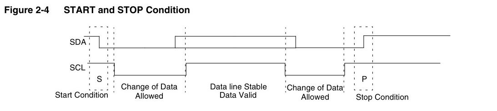

### 寻址从机
7bit和10bit地址格式支持
这里没什么东西，7bit地址总是先发送高bit，再发送低bit，读写位最后发
10bit地址，需要发两个byte，第一个byte向从机指示这个地址是10bit地址（也可用作SMBus命令）
bit[7:3] = 0b11110
bit[2:0] = A9 A8 R/W
第一个BTYE发送后，从机给一个ACK
然后发送第二个byte，也就是地址低位 A7 - A0

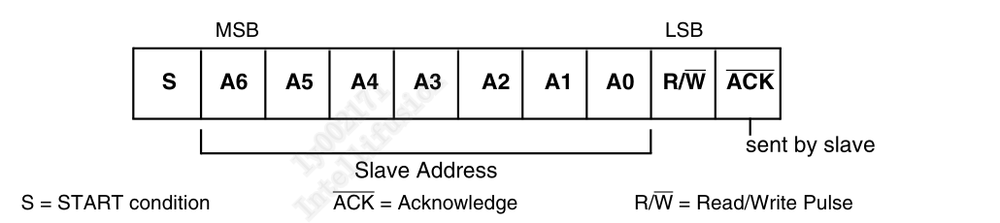

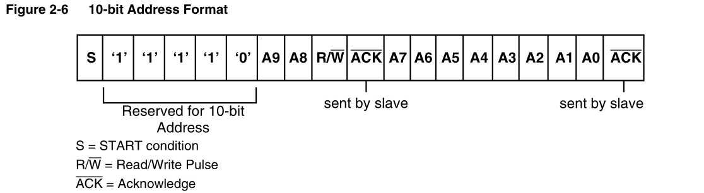


第一个byte的含义对应表
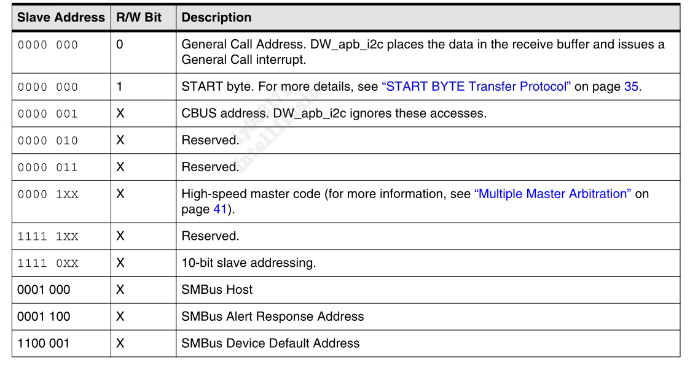

### Transmitting and Receving Protocal

主从机角色和职责：
1. 主机（Master）的角色
唯一发起者：只有主机能主动发起一次总线传输（包括 START 条件、地址、读写命令等），从机永远不能主动发起通信。
两种传输角色：
Master-transmitter（主机发送器）：主机向总线发送数据（例如向从机写数据）。
Master-receiver（主机接收器）：主机从总线接收数据（例如从从机读数据）。
2. 从机（Slave）的角色
被动响应者：从机只能等待主机的寻址和命令，不能主动发起传输。
两种传输角色：
Slave-transmitter（从机发送器）：当主机对从机执行 “读操作” 时，从机向总线发送数据。
Slave-receiver（从机接收器）：当主机对从机执行 “写操作” 时，从机从总线接收数据。
总结
主机决定 “说什么、什么时候说”，并可以作为发送方或接收方。
从机只在被主机点名时响应，并根据主机的读写命令，决定自己是发送还是接收。


#### Master-Transmitter and Slave-Receiver
介绍主机发送，从机接受的时序。这个没什么好说的。

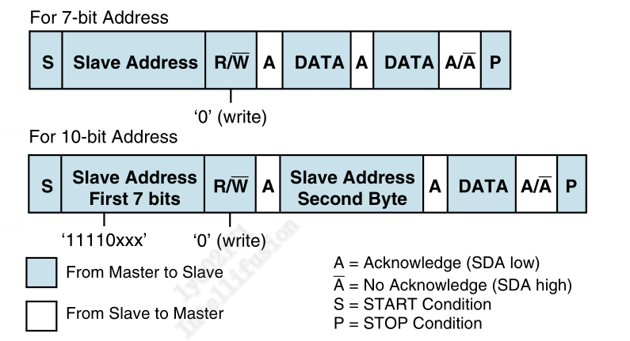

#### Master-Receiver and Slave-Transmitter 
介绍主机接受，从机发送的时序
这里有些细节：
1. 主机收到最后一个byte后发送NACK，从机检测到这个NACK后，必须交出bus(SDA的控制权)，主机才能发送STOP信号
2. 主机连续读/写情况下都不需要将总线交出去，读写交替时除外。一般一次传输包括start，地址，值，ACK，stop。如果要切换读写，必须先STOP，再次START。RESTART信号可以优化这个情况，主机无需STOP，直接在从机的ACK之后，发送一个RESTART，开启新的事务。

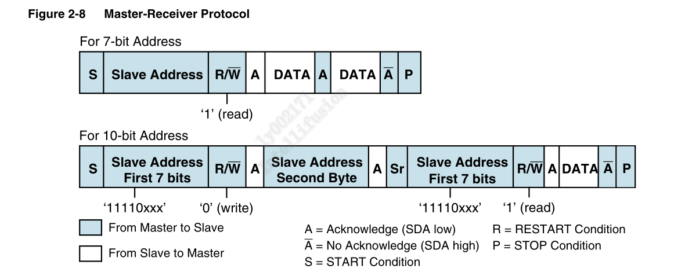

#### START BYTE

START BYTE Transfer Protocol主要是为了兼容那些片上没有专用I2C硬件模块的系统而设计的。

- 当 DW_apb_i2c 作为从机时，它会以最高支持的速度采样总线，避免错过 START BYTE 传输。
- 当它作为主机时，会在每次传输开始时生成 START BYTE，以兼容需要它的从机设备。

START BYTE的结构是一个固定的8位序列：
```
0000 0001
```
7 个连续的 0，后面跟着一个 1
这样设计的目的是：

- 让轮询总线的处理器（没有专用硬件的微控制器）可以用较低的采样率（欠采样）来检测地址阶段。
- 一旦检测到第一个 0，它就会切换到主机的正确采样速率，以保证后续通信的准确性。

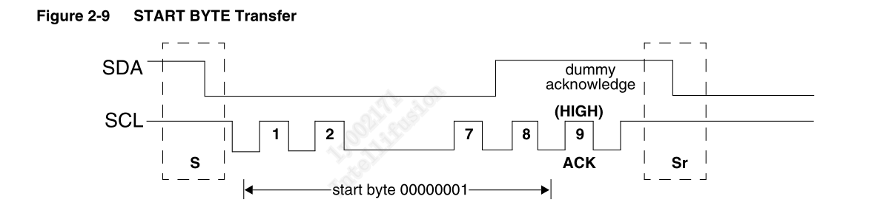

时序解析：
1. S (START Condition)
主机拉低 SDA，同时 SCL 保持高电平，产生 I²C 标准的 START 条件。
2. START Byte (0000 0001)
在 SCL 的 8 个时钟脉冲下，主机依次发送 7 个 0 和 1 个 1。
图中标注的 1 到 8 代表这 8 个数据位的传输。
3. Dummy ACK (第 9 个时钟)
主机产生第 9 个 SCL 脉冲，这是为了符合 I²C 的字节传输格式。
但这是一个 “虚拟应答”（dummy acknowledge）：没有从机拉低 SDA 来产生 ACK 信号，所以 SDA 保持高电平（HIGH）。
4. Sr (RESTART Condition)
主机再次产生一个 RESTART 条件，为后续的正常 I²C 传输做准备。

- 硬件接收器不响应 START BYTE：因为它是一个保留地址，并且在 RESTART 条件产生后会自动复位。
- 主要作用：让没有专用 I²C 硬件的微控制器（纯软件模拟 I²C）能够正确同步到总线速率，从而参与后续的通信。

> 没有专用I2C硬件的控制器，如何通过START BYTE实现总线速率同步？
> 主机发送：START条件 → 开始发 Start Byte（第一位是0），低端从机此时采样到连续的低电平，开启定时器/或者其他方式，计算时间。直到START BYTE的最后一个bit的高电平到来，低端从机结束时间计算，获取到前7个低电平时钟周期的耗时，比如每个SCL时钟周期=10us，那么主机I2C速率约等于100Kbps(标准速率)


#### I2C Tx FIFO Management

IC_EMPTYFIFO_HOLD_MASTER_EN配置决定了当Tx FIFO变为空时，控制器是否会保持总线占用，是否主动结束当前传输。
除此之外，IC_EMPTYFIFO_HOLD_MASTER_EN配置还决定IC_DATA_CMD的构造。

##### IC_EMPTYFIFO_HOLD_MASTER_EN = 0

Tx FIFO 为空时：
- 主机发送器：在当前字节传输完成后，自动生成 STOP 条件 结束传输。
- 如果支持 RESTART：当传输方向（读 / 写）切换时，生成 RESTART；不支持 RESTART 时，则生成 STOP + START。

IC_DATA_CMD寄存器结构：

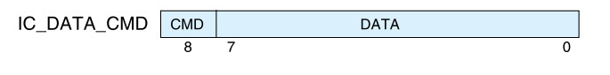

CMD（第 8 位）：只写，决定传输类型
- CMD = 1 → 读操作（Read）
- CMD = 0 → 写操作（Write）
DATA（第 0-7 位）：读写数据区
- 读操作：从从机读取的数据从这里读出
- 写操作：要发送给从机的数据写入这里

###### 主机发送器（Master Transmitter）时序

1. Tx FIFO 加载数据：软件向 Tx FIFO 写入要发送的数据（CMD=0）。
2. 触发 START：FIFO 有数据后，控制器自动在总线上产生 START 条件，开始传输。
3. 数据传输：依次发送从机地址 + 写位（W）+ 数据字节，每个字节后跟随 ACK。
4. Tx FIFO 变空：当最后一个字节被弹出（popped）后，Tx FIFO 为空。
5. 生成 STOP：Tx FIFO 为空触发控制器在总线上生成 STOP 条件，结束传输。

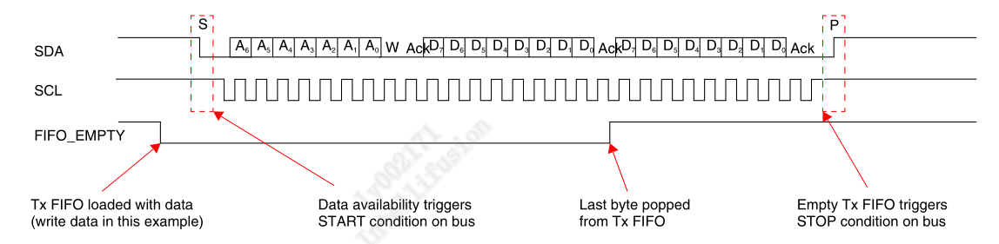

###### 主机接收器（Master Receiver）时序

1. Tx FIFO 加载命令：软件向 Tx FIFO 写入读命令（CMD=1）。
2. 触发 START：FIFO 有命令后，控制器自动产生 START 条件。
3. 数据传输：发送从机地址 + 读位（R），然后依次读取数据字节，最后发送 NAK。
4. Tx FIFO 变空：最后一个读命令被弹出后，Tx FIFO 为空。
5. 生成 STOP：Tx FIFO 为空触发控制器生成 STOP 条件，结束传输。

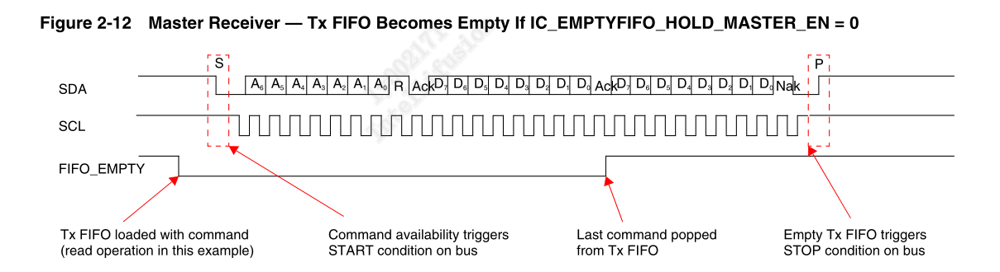

###### 特殊case

当同时满足：
- IC_EMPTYFIFO_HOLD_MASTER_EN = 0
- TX_EMPTY_CTRL = 1
- TX_THLD = 0 （TX FIFO水线，一旦FIFO中剩余数据<TX_THLD，立即产生中断）

会出现以下行为：
- 一个包含多个命令的 I²C 帧，会被拆分成多个帧。
- 原因：DW_apb_i2c 在每段数据发送结束后，都会产生一个 TX_EMPTY 中断。
- 软件会在每次中断时，才向空的 Tx FIFO（TX_THLD=0）中推入新数据，导致传输被打断成多个独立的帧。

TX_THLD = 0，TX FIFO里数据为0时才产生中断，此时控制器已经发送了STOP信号出去，TX中断里开始补充数据，晚了，STOP都发出去了，重新开始发START吧，这就导致每个byte的数据都是单独的一帧。

##### IC_EMPTYFIFO_HOLD_MASTER_EN = 1

Tx FIFO 为空时：
- 主机发送器：在当前字节传输完成后，不生成 STOP 条件，不结束传输，（SCL clock stretching），`Stalling Bus` 等Tx FIFO有新的数据到来。
- 如果要生成STOP信号，只有当最后一个弹出的字节，且必须特别指定STOP bit为1在IC_DATA_CMD寄存器中

IC_DATA_CMD寄存器结构：

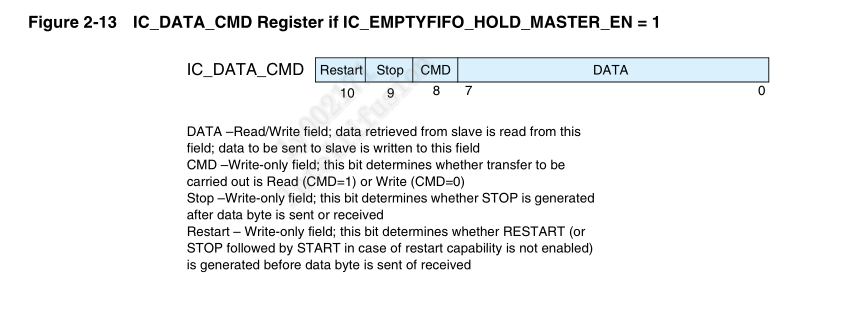

RESTART（第 10 位）：只写，决定是否生成restart信号(当然前提得支持restart)
STOP （第 9 位）：只写，决定是否数据发送/接受后生成stop信号
CMD（第 8 位）：只写，决定传输类型
- CMD = 1 → 读操作（Read）
- CMD = 0 → 写操作（Write）
DATA（第 0-7 位）：读写数据区
- 读操作：从从机读取的数据从这里读出
- 写操作：要发送给从机的数据写入这里

###### 主机发送器（Master Transmitter）时序

发送最后一个data，不带stop bit，最后一个data被pop出去时，主机会hold scl为低，等到Tx FIFO被新的数据填充，开启新的数据帧。

最后一个data带stop bit，主机才会主动释放SCL。新的数据到来时再恢复传输。

主机可以主动触发stop condition，通过在IC_CMD_DATA的stop bit置位。

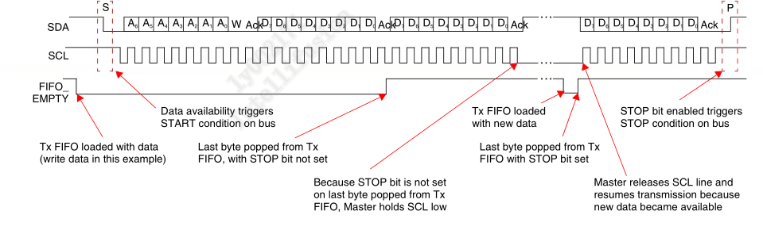


###### 主机接收器（Master Receiver）时序

FIFO 空但 STOP 位未设置：最后一个读命令弹出，FIFO 为空。STOP 位未设置 → 控制器拉低 SCL，保持总线。
软件重新填充 FIFO：写入新的读命令。
恢复传输：SCL 释放，继续读取数据。
STOP 位设置时：最后一个命令带有 STOP 位 → 生成 STOP，结束传输。

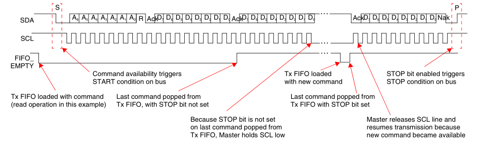

###### RESTART 条件生成

当 IC_DATA_CMD 寄存器的第 10 位（Restart）= 1，且 IC_RESTART_EN = 1 时：
- 发送器：
  - 下一个要弹出的字节被标记了 RESTART 位。
  - 当前字节传输完成后，控制器生成 RESTART（Sr），而不是 STOP。
  - 然后立即开始新的传输（地址 + W + 数据）。
  - 如果 FIFO 先空了，会先拉低 SCL，等新数据加载后再发 RESTART。
- 接收器：
  - 作为接收器，**在 RESTART 前必须先发送 NACK**。
  - 然后生成 RESTART，开始新的读传输（地址 + R + 数据）。
  - 若 FIFO 空，先拉低 SCL，等新命令加载后再执行 RESTART。

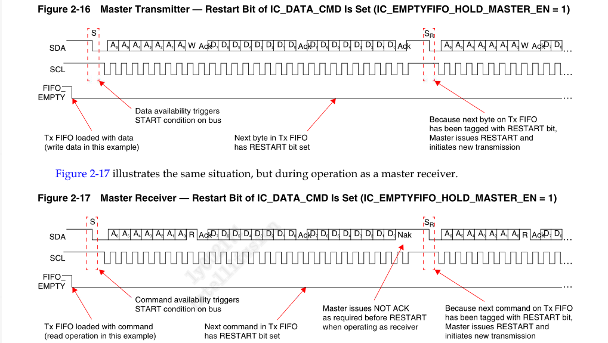

###### STOP 位强制结束

即使 Tx FIFO 还有数据，只要最后一个弹出的字节 / 命令设置了 STOP 位：
- 控制器会在该字节 / 命令传输完成后，立即生成 STOP 条件。
- 即使 FIFO 中还有剩余数据，传输也会被强制结束。
- 如果之后 FIFO 又有新数据，控制器会重新发起 START，开始新的传输。

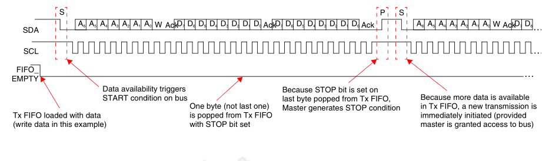

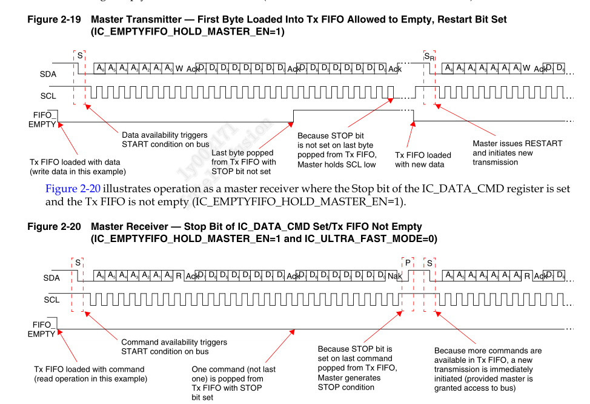

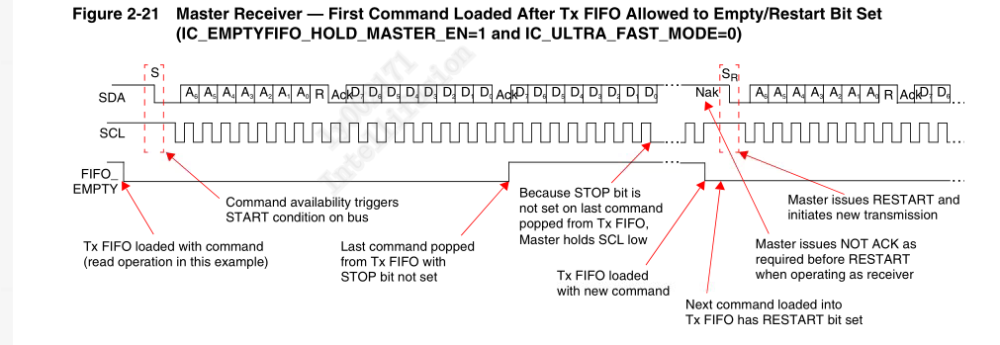

##### IC_EMPTYFIFO_HOLD_MASTER_EN 配置差异

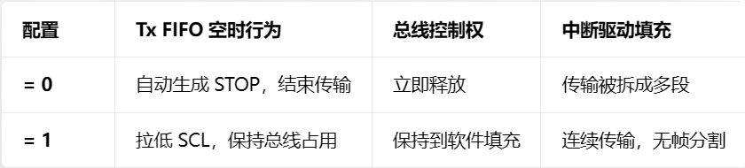

#### multiple master arbitration
TODO

#### clock synchronization
TODO

### I2C Operation Mode

#### Slave Mode

##### Slave Initiate

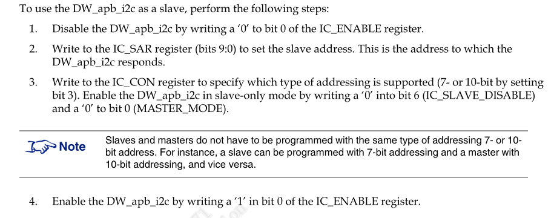

##### Slave-Transmitter Operation for Single Byte

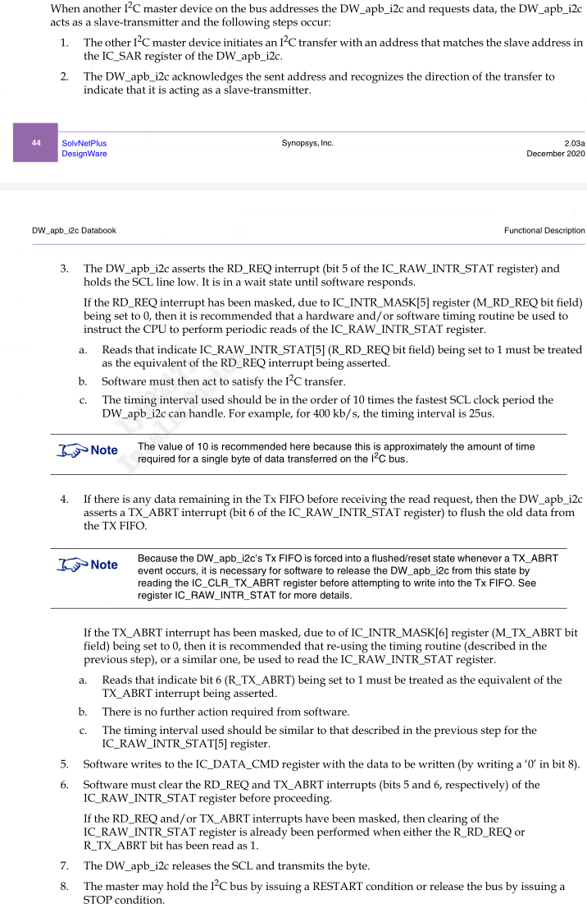

总结从机单字节操作的流程图
核心为两个中断:
1. RD_REQ
2. TX_ABRT

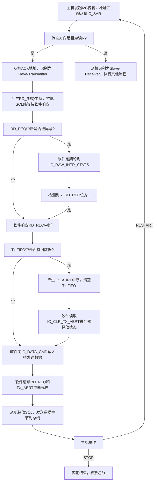
```mermaid
flowchart TD
    A[主机发起I2C传输，地址匹配从机IC_SAR] --> B[传输方向是否为读R?]
    B -- 是 --> C[从机ACK地址，识别为Slave-Transmitter]
    C --> D[产生RD_REQ中断，拉低SCL线等待软件响应]
    D --> E[RD_REQ中断是否被屏蔽?]
    E -- 否 --> F[软件响应RD_REQ中断]
    E -- 是 --> G[软件定期轮询IC_RAW_INTR_STAT.5]
    G --> H[检测到R_RD_REQ位为1]
    H -- 是 --> F
    F --> I[Tx FIFO中是否有旧数据?]
    I -- 是 --> J[产生TX_ABRT中断，清空Tx FIFO]
    J --> K[软件读取IC_CLR_TX_ABRT寄存器释放状态]
    I -- 否 --> L[软件向IC_DATA_CMD写入待发送数据]
    K --> L
    L --> M[软件清除RD_REQ和TX_ABRT中断标志]
    M --> N[从机释放SCL，发送数据字节到总线]
    N --> O[主机操作]
    O -- RESTART --> A
    O -- STOP --> P[传输结束，释放总线]
    B -- 否 --> Q[从机识别为Slave-Receiver，执行其他流程]
```
从机可以主动拉低SCL，发送完数据后release总线。


###### Slave-Receiver Operation for Single Byte

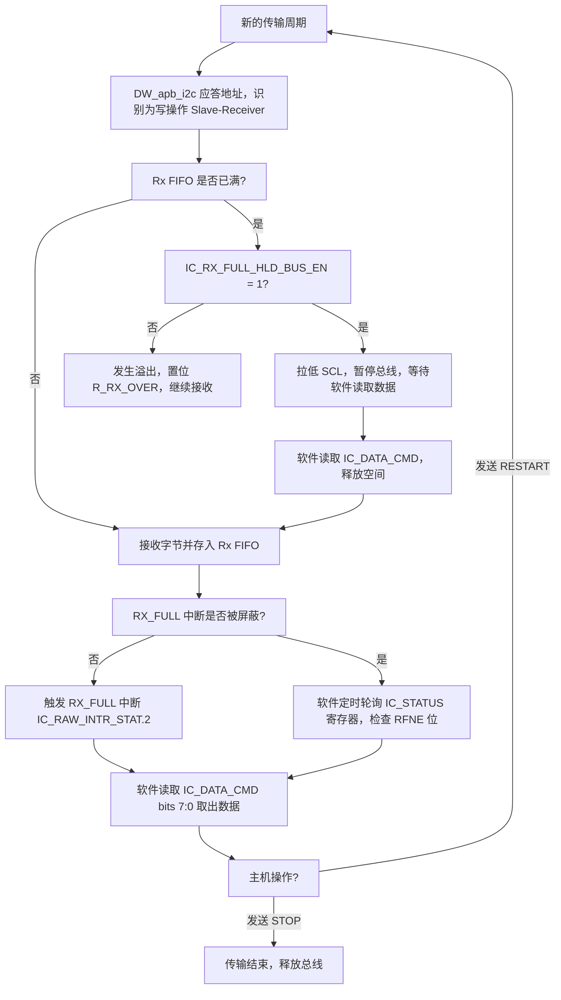
```mermaid
flowchart TD
    A[I²C 主机发起传输，地址匹配 IC_SAR] --> B[DW_apb_i2c 应答地址，识别为写操作 Slave-Receiver]
    B --> C[Rx FIFO 是否已满?]
    C -->|否| D[接收字节并存入 Rx FIFO]
    C -->|是| E[IC_RX_FULL_HLD_BUS_EN = 1?]
    E -->|是| F[拉低 SCL，暂停总线，等待软件读取数据]
    F --> G[软件读取 IC_DATA_CMD，释放空间]
    G --> D
    E -->|否| H[发生溢出，置位 R_RX_OVER，继续接收]
    D --> I[RX_FULL 中断是否被屏蔽?]
    I -->|否| J[触发 RX_FULL 中断 IC_RAW_INTR_STAT.2]
    I -->|是| K[软件定时轮询 IC_STATUS 寄存器，检查 RFNE 位]
    J --> L[软件读取 IC_DATA_CMD bits 7:0 取出数据]
    K --> L
    L --> M[主机操作?]
    M -->|发送 STOP| N[传输结束，释放总线]
    M -->|发送 RESTART| A[新的传输周期]
```

###### Slave Transfer Operation for Bulk Transfers

1. 批量传输的核心设计思想
在标准 I²C 协议中，单次读请求通常只传输一个字节，这会**导致频繁的中断开销**。DW_apb_i2c 支持批量传输模式，允许软件预先将多个字节写入 TX FIFO，然后在一次传输中连续发送，从而消除了每次数据传输都触发中断的延迟。
2. 关键操作与状态处理
**读请求触发（RD_REQ）：**
当远程主机向从机发起读请求时，DW_apb_i2c 会产生 RD_REQ 中断（M_RD_REQ 位）。
如果 TX FIFO 为空，从机将拉低 SCL 时钟线，暂停传输，等待软件向 TX FIFO 写入数据。
如果 RD_REQ 中断被屏蔽，软件需要通过定时轮询 IC_RAW_INTR_STAT 寄存器（检查 R_RD_REQ 位）来等效处理。
**批量数据填充与发送：**
软件可以预先将多个字节（例如主机请求的 n 字节）一次性写入 TX FIFO。
**从机在主机应答每个字节后，会自动从 TX FIFO 中取出下一个字节发送，无需软件干预。**
当主机确认接收最后一个字节后，如果还需要更多数据，从机会再次触发 RD_REQ 中断。
**数据长度不匹配的处理：**
如果写入 TX FIFO 的字节数多于主机请求的 n 字节：从机发送完 n 字节后，会清空 TX FIFO 并忽略多余字节，同时产生 TX_ABRT（发送中止）事件。
如果写入 TX FIFO 的字节数少于主机请求的 n 字节：从机发送完 FIFO 中的数据后，会拉低 SCL 线，等待软件补充数据。
**ACK/NACK 与 FIFO 清空：**
当主机接收到所有需要的数据并返回 NACK 时，从机状态机中的标志位会被置位，触发 TX FIFO 的清空操作，以清除残留数据。

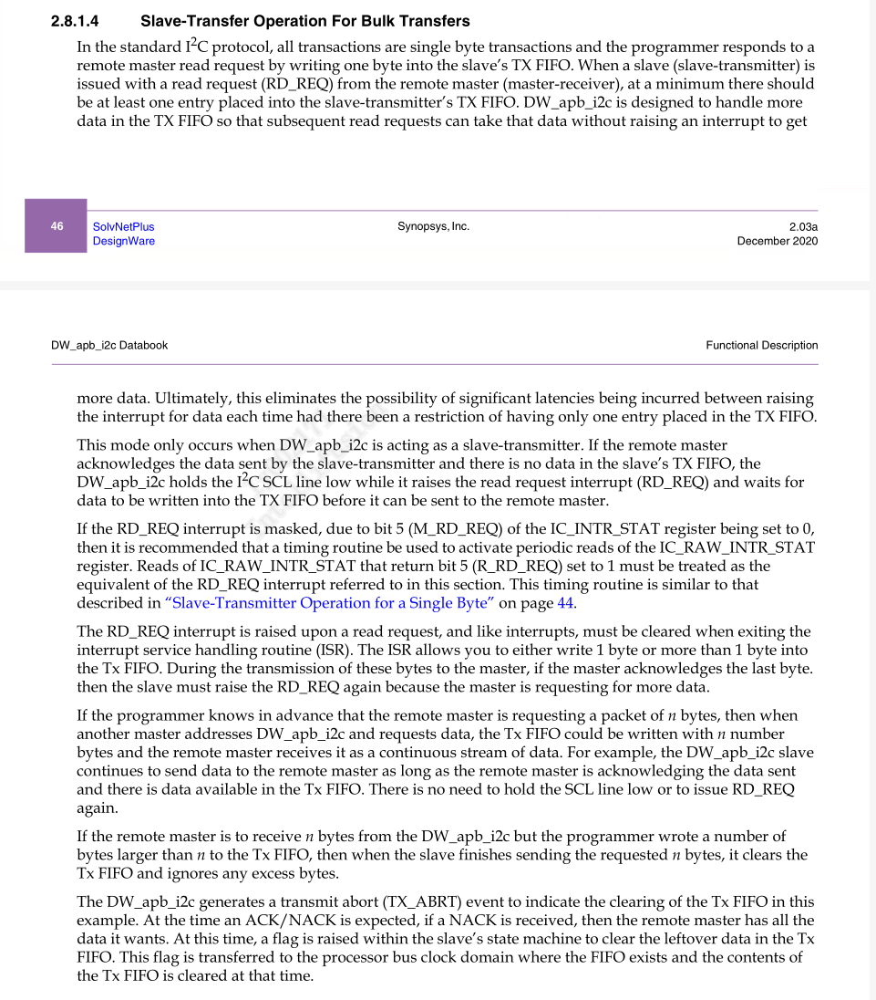

总结流程图：

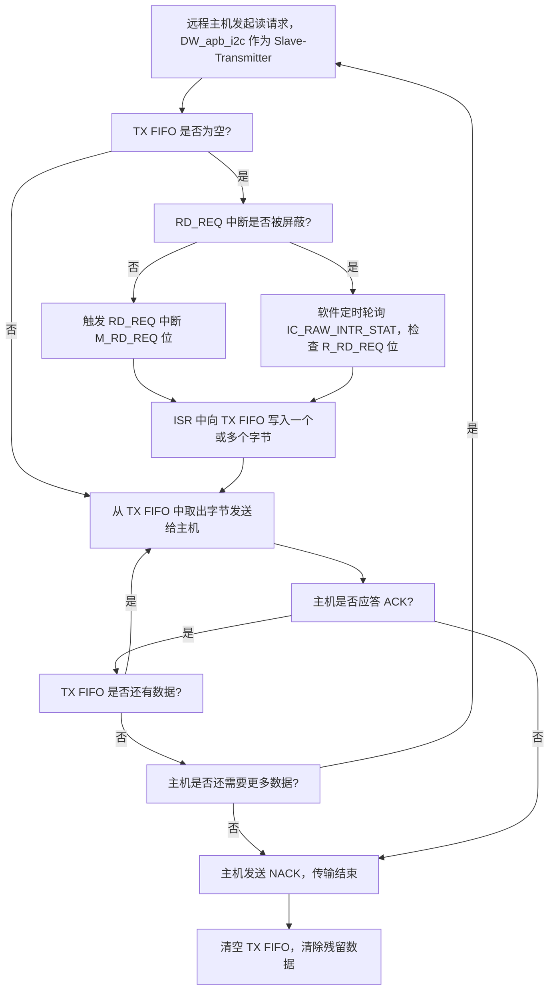
```mermaid
flowchart TD
    A[远程主机发起读请求，DW_apb_i2c 作为 Slave-Transmitter] --> B[TX FIFO 是否为空?]
    B -->|否| C[从 TX FIFO 中取出字节发送给主机]
    B -->|是| D[RD_REQ 中断是否被屏蔽?]
    D -->|否| E[触发 RD_REQ 中断 M_RD_REQ 位]
    D -->|是| F[软件定时轮询 IC_RAW_INTR_STAT，检查 R_RD_REQ 位]
    E --> G[ISR 中向 TX FIFO 写入一个或多个字节]
    F --> G
    G --> C
    C --> H[主机是否应答 ACK?]
    H -->|是| I[TX FIFO 是否还有数据?]
    I -->|是| C
    I -->|否| J[主机是否还需要更多数据?]
    J -->|是| A
    J -->|否| K[主机发送 NACK，传输结束]
    H -->|否| K
    K --> L[清空 TX FIFO，清除残留数据]
```

#### Master Mode

主机模式下有个很重要的配置参数： I2C_DYNAMIC_TAR_UPDATE 
决定了主机模式下目标地址（TAR）和传输参数的更新时机

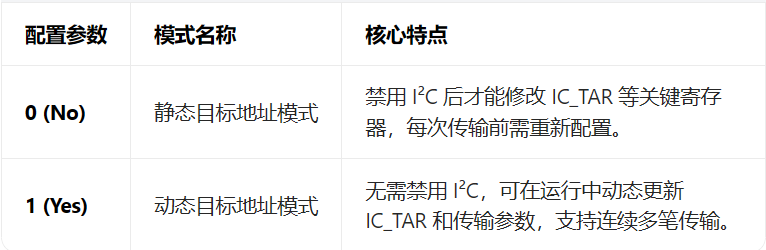

##### I2C_DYNAMIC_TAR_UPDATE = 0

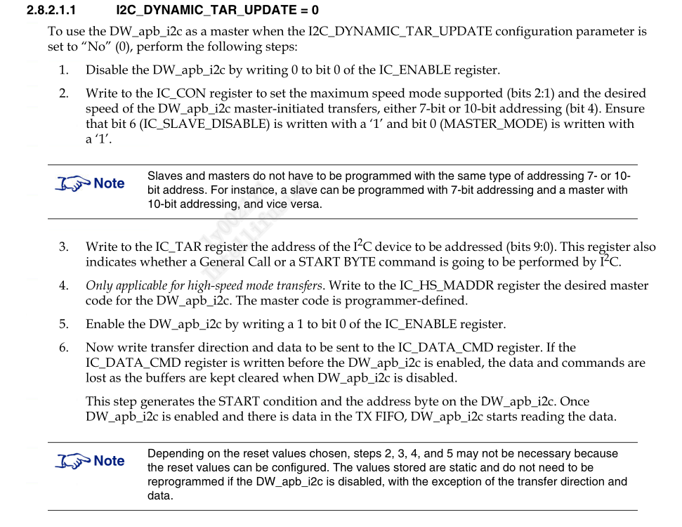

##### I2C_DYNAMIC_TAR_UPDATE = 1

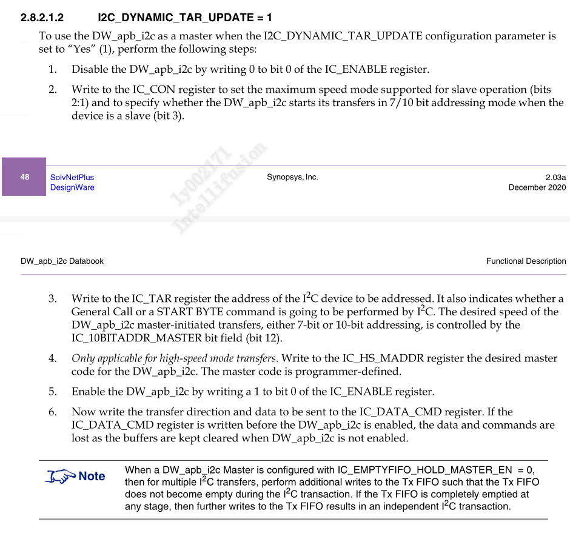

1. I2C_DYNAMIC_TAR_UPDATE = 0（静态模式）
禁用控制器：向 IC_ENABLE[0] 写入 0，关闭 DW_apb_i2c。
配置控制寄存器：
写入 IC_CON：设置最大速度模式（bits 2:1）、地址模式（7/10-bit，bit 4）。
必须确保 IC_SLAVE_DISABLE (bit 6) = 1 和 MASTER_MODE (bit 0) = 1，使设备作为主机工作。
设置目标地址：写入 IC_TAR，指定要访问的从机地址（bits 9:0），并指示是否为通用呼叫或 START BYTE 命令。
高速模式配置（可选）：若使用高速模式，写入 IC_HS_MADDR 寄存器设置主机码。
启用控制器：向 IC_ENABLE[0] 写入 1，使能 DW_apb_i2c。
发起传输：向 IC_DATA_CMD 寄存器写入传输方向和数据，生成 START 条件并开始传输。
注：此模式下，若要访问新的从机地址，必须重复步骤 1-6，即先禁用、重配置、再启用。

2. I2C_DYNAMIC_TAR_UPDATE = 1（动态模式）
禁用控制器（初始化阶段）：向 IC_ENABLE[0] 写入 0，关闭 DW_apb_i2c。
配置控制寄存器：
写入 IC_CON：设置从机操作的最大速度模式（bits 2:1）和从机地址模式（bit 3）。
**主机的地址模式（7/10-bit）由 IC_10BITADDR_MASTER (bit 12) 控制，可动态修改**。
设置目标地址：写入 IC_TAR，指定要访问的从机地址。传输速度和地址模式可在运行中通过 IC_10BITADDR_MASTER 动态调整。
高速模式配置（可选）：若使用高速模式，写入 IC_HS_MADDR 寄存器设置主机码。
启用控制器：向 IC_ENABLE[0] 写入 1，使能 DW_apb_i2c。
发起传输：向 IC_DATA_CMD 寄存器写入传输方向和数据。如需切换目标地址，可直接写入新的 IC_TAR，无需禁用控制器，即可发起新的 I²C 事务。
注：此模式下，当 IC_EMPTYFIFO_HOLD_MASTER_EN = 0 时，可连续执行多笔传输；若 Tx FIFO 被清空，后续写入将自动开启新的独立事务。

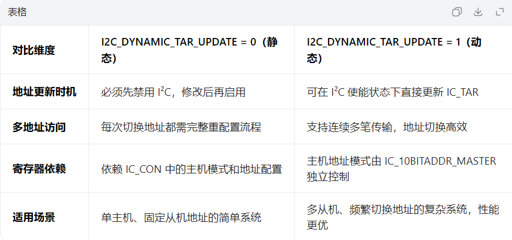


##### Master Transmit / Master Receive 动态切换机制

这里主要介绍 DW_apb_i2c 作为主机时，如何在发送（写）和接收（读）操作之间动态切换，以及 Tx FIFO 空时的两种总线行为策略。

1. 动态读写切换的核心机制
数据与命令写入：
   - 所有传输命令（读 / 写）和数据都通过同一个寄存器 IC_DATA_CMD 下发。
   - 写操作（Transmit）：向 IC_DATA_CMD[7:0] 写入要发送的数据，并将 CMD bit[8] 置为 0。
   - 读操作（Receive）：向 IC_DATA_CMD[7:0] 写入任意值（don't care），并将 CMD bit[8] 置为 1。
连续传输：
只要 Tx FIFO 中还有未处理的命令，DW_apb_i2c 就会持续发起 I²C 传输，自动在读写操作之间切换。
2. Tx FIFO 空时的两种总线行为
当 Tx FIFO 为空时，主机的行为由 IC_EMPTYFIFO_HOLD_MASTER_EN 控制：

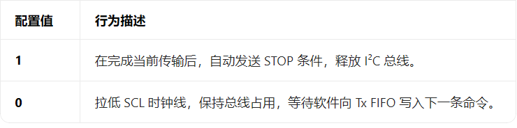

```
注：
当 IC_DATA_CMD[9] = 1 时，会覆盖上述行为，强制在当前传输后发送 STOP 条件。
Ultra-Fast Mode（IC_ULTRA_FAST_MODE = 1）：不支持主机接收模式（Master Receiver Mode），因此主机读操作是被禁止的。
```

##### disabling dw_apb_i2c && procedure
在 DW_apb_i2c v1.05a 及更早版本中，软件需要同时监控 IC_STATUS 和 IC_RAW_INTR_STAT 两个寄存器，才能判断硬件是否已完全关闭。从 v2.03a 开始，新增了 **IC_ENABLE_STATUS** 寄存器，软件只需监控该寄存器的 IC_EN 位（bit 0），即可明确判断硬件是否已完成关闭，简化了流程。

###### 安全禁用 && 强制中止

安全禁用条件：
只有当正在处理的命令已经设置了 STOP 位（STOP bit set to 1）时，DW_apb_i2c 主机才能被安全禁用。
如果在处理未设置 STOP 位的命令时尝试禁用，主机将继续保持活跃，拉低 SCL 线，直到 Tx FIFO 收到新命令。

强制中止（ABORT）：
当 IC_EMPTYFIFO_HOLD_MASTER_EN = 1，且主机正在处理未设置 STOP 位的命令时，若需立即禁用，可通过向 IC_ENABLE[1] 写入 1 来触发 ABORT 操作，主动放弃 I²C 总线控制权，然后再执行禁用流程。

###### 标准禁用流程

这是一个安全、可靠的软件禁用流程，确保硬件完全关闭后再继续操作：

定义轮询间隔：
设置 t_i2c_poll 为系统最高 I²C 传输速率信号周期的 10 倍。例如，400 kb/s 速率下，信号周期为 2.5 µs，t_i2c_poll = 25 µs。

定义超时参数：
设置 MAX_T_POLL_COUNT 作为最大轮询次数，若轮询超过该次数仍未完成禁用，则报告错误。

阻塞新事务：
执行阻塞逻辑，阻止软件发起新的 I²C 主机事务，但允许已挂起的传输完成。
> 注：若 DW_apb_i2c 仅作为从机使用，此步骤可忽略。

初始化轮询计数器：
将 POLL_COUNT 置为 0。

发起禁用请求：
向 IC_ENABLE[0] 写入 0，请求关闭 DW_apb_i2c。

轮询状态寄存器：
读取 IC_ENABLE_STATUS，检查 IC_EN 位（bit 0）。
每次读取后，POLL_COUNT 加 1。若 POLL_COUNT >= MAX_T_POLL_COUNT，则退出并返回错误码。

等待或完成：
若 IC_ENABLE_STATUS[0] = 1，则休眠 t_i2c_poll 时间，回到步骤 6 继续轮询。
若 IC_ENABLE_STATUS[0] = 0，则表示硬件已完全关闭，退出并返回成功码。

##### Abort transfer
ABORT 是 DW_apb_i2c 主机模式下的一个强制中止机制，用于在传输未完成时主动放弃总线控制权。

触发方式：通过向 IC_ENABLE[1] 写入 1 来发起 ABORT 请求。
硬件响应：
在 I²C 总线上发送 STOP 条件，终止当前传输。
清空 Tx FIFO，丢弃所有未执行的传输命令。
使用限制：仅在主机模式下有效，从机模式不支持 ABORT 操作。

标准中止流程（Procedure）
停止填充 Tx FIFO：软件不再向 IC_DATA_CMD 寄存器写入新的传输命令。
禁用 DMA（可选）：如果系统工作在 DMA 模式下，需将 TDMAE 置为 0，关闭发送 DMA。
发起 ABORT：向 IC_ENABLE[1] 写入 1，触发中止操作。
等待中断：等待 M_TX_ABRT 中断触发，表明硬件已完成中止。
检查中止源：读取 IC_TX_ABRT_SOURCE 寄存器，确认中止原因为 ABRT_USER_ABRT（即软件主动发起的 ABORT）。

##### 毛刺抑制
I²C 总线（开漏信号）在长线传输、上拉电阻、噪声干扰下，SCL/SDA 可能出现很短的毛刺（glitch）。如果这些毛刺被内部采样到，会导致：

- 误判 START/STOP
- 误读 bit
- 协议崩溃

毛刺抑制就是用计数器过滤掉这些短毛刺，只保留 “稳定超过一定时间” 的信号。

I2C控制器的毛刺抑制的工作原理是`为 SCL 和 SDA 分别提供独立的计数器。`

规则如下：
1. 计数器启动条件
只要输入信号（SCL/SDA）发生跳变，计数器就从 0 开始计数。
1. 两种关键行为
   - 情况 A：信号稳定（成功滤波）
   如果输入信号在计数器达到 计数上限（SPKLEN） 前一直不变：
   内部采样信号更新为当前值
   计数器复位并停止
   → 这个信号被 “确认”，毛刺被过滤掉。
   - 情况 B：信号再次跳变（毛刺被滤除）
   如果信号在计数到上限前再次跳变：
   计数器复位并停止
   内部信号不更新
   这次毛刺被忽略
   → 短噪声不会破坏协议。


###### 毛刺抑制案例

第一个SCL跳变，历经2个周期又跳回来。计数器在第一次跳变开始工作，假设count limit是5，ic_clk周期为10ns，毛刺移植时长为50ns。第一段小毛刺约为20-30ns，不更新内部信号。
第二段>50ns，计数器到5，更新内部信号。

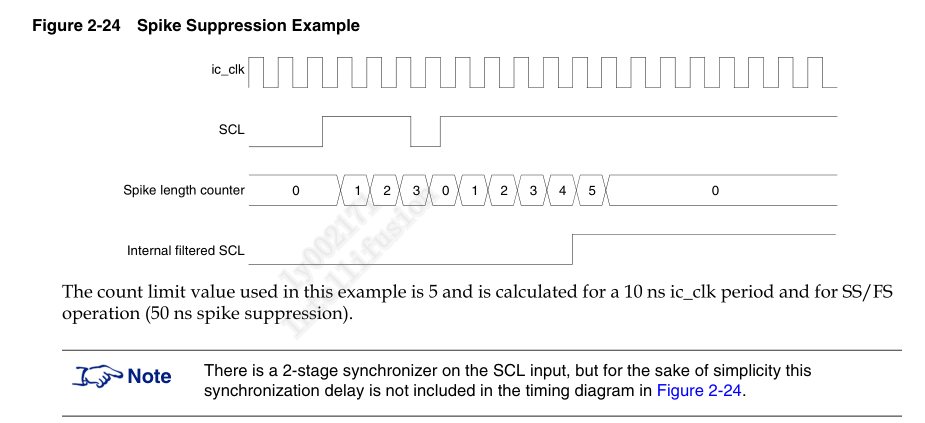

######  三个关键 SPKLEN 寄存器
I²C 不同模式要求不同最大毛刺长度：
- **SS/FS：50 ns**
- HS：10 ns
- UFm：10 ns
因此需要三个寄存器：
- IC_FS_SPKLEN（SS/FS）
- IC_HS_SPKLEN（HS）
- IC_UFM_SPKLEN（UFm）
注意：
它们 互斥不共存
高速模式和超高速模式不能同时使用
不同模式自动使用不同寄存器

注意：
DW_apb_i2c 的毛刺抑制讲解内容核心是：
- 使用计数器过滤 SCL/SDA 短毛刺
- 信号稳定超过 SPKLEN 时间才更新内部信号
- 用三个 SPKLEN 寄存器分别支持 SS/FS/HS/UFm 模式
- 寄存器最小值是 1，且必须在禁用控制器时写入
- **内部逻辑会增加固定时钟周期开销，因此 LCNT/HCNT 有最小值约束**


#### Fast Mode
TODO:
1. 配置速率模式寄存器
2. 配置ic_clk大于等于32MHz
3. 配置IC_CON寄存器，切换fast mode或者fast mode plus
4. 配置IC_FS_SCL_LCNT和IC_FS_SCL_HCNT寄存器，迎合fast mode plus的SCL
5. 编程IC_FS_SPKLEN寄存器，配置最大毛刺抑制时间
6. 编程IC_SDA_SETUP寄存器，满足最小数据建立时间 (tSU; DAT)

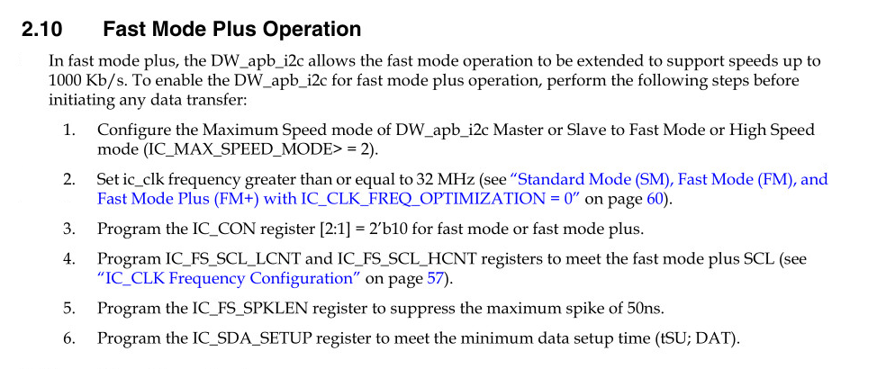

#### Bus Clear

Bus Clear 是 DWC_apb_i2c 提供的总线故障恢复机制，专门用于处理 SDA 或 SCL 线被意外拉低（stuck at LOW） 的异常场景，避免总线永久死锁。
二、SDA Line Stuck at LOW Recovery（SDA 线被拉低的恢复）
当 SDA 线被意外拉低时，主机通过主动发送时钟脉冲来尝试恢复：
尝试恢复：
主机最多发送 9 个 SCL 时钟脉冲，同时尝试将 SDA 线驱动为高电平，检查是否恢复。
实际发送的时钟数取决于**从机还需发送的位数**（最大为 9 位，因此最多 9 个时钟）。
如果在 9 个时钟内 SDA 恢复为高电平，主机发送 STOP 条件，释放总线。
如果第 9 个时钟后 SDA 仍为低电平，则需要硬件复位。
时序示例：
主机发送 9 个 SCL 时钟，最终成功将 SDA 拉高。
从机剩余 6 位数据，因此主机仅发送 6 个 SCL 时钟，SDA 即恢复。

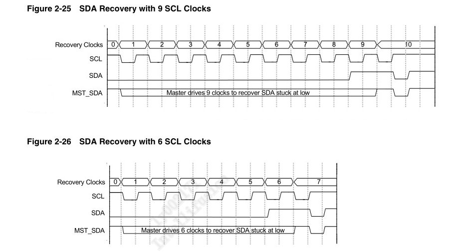

三、SCL Line is Stuck at LOW（SCL 线被拉低）
当 SCL 线被意外拉低时，**由于时钟是通信的同步基准，没有有效的软件恢复手段：**
唯一解决方案：必须通过硬件复位信号来重置整个 I²C 总线，才能恢复通信。
这是因为 SCL 被拉低后，主机无法产生时钟，整个总线协议无法继续运行。

#### Ultra-Fast MODE

Ultra-Fast Mode 是 I²C 协议的一个高速变种，**专为单向、无反馈的高速传输设计**：
速率范围：DC (0) ~ 5 MHz
典型应用：驱动 LED 控制器、游戏外设等不需要从机应答的场景

与标准 I²C 相比，UFm 有以下核心区别：
- 单向传输：
仅支持主机向从机的 “写” 操作（命令位固定为 0），不支持读操作。
第 9 个时钟（ACK 周期）由主机主动驱动为高电平，忽略从机的应答，本质上是强制 NACK。
从机永远不会在总线上驱动任何信号。
- 电气特性：
使用推挽式（push-pull）驱动器，而非标准 I²C 的开漏（open-drain）驱动器。
主机输出信号（USCL、USDA）为低电平有效（Active-Low）。
从机输入信号为高电平有效（Active-High）。
- 总线拓扑：
无多主机支持：主机是唯一的总线发起者，不存在仲裁、同步或时钟拉伸机制。
所有其他设备均为从机，仅接收数据。
- 帧格式：
START、STOP 条件的生成方式与标准模式一致。
唯一的区别是第 9 个时钟周期，主机强制发送 NACK。

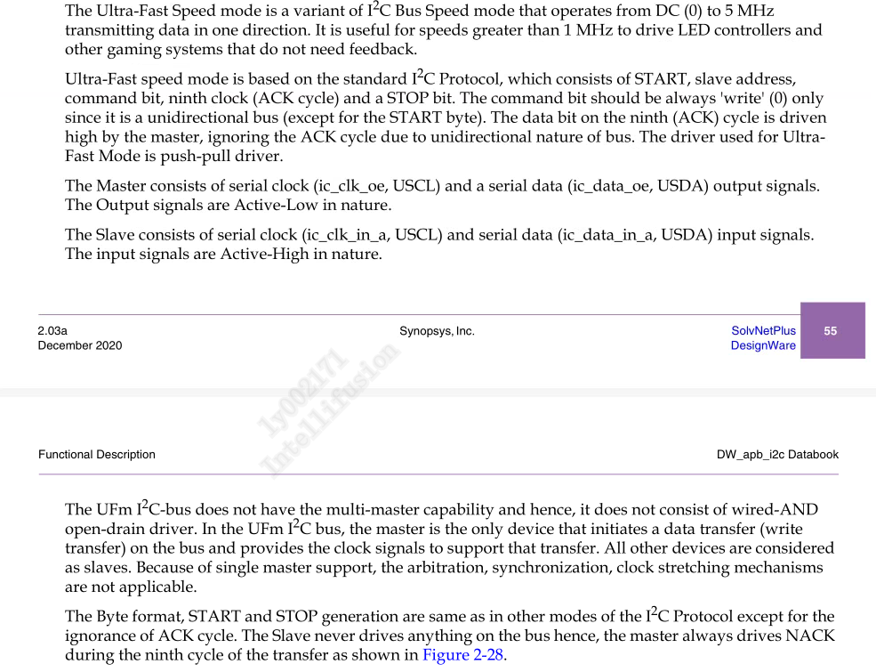

#### IC_CLK Frequence Configuration

当 DW_apb_i2c 作为主机时，必须根据工作模式配置对应的 ***CNT 寄存器**，以生成符合 I²C 规范的 SCL 时钟高低电平周期，确保 I/O 时序正确

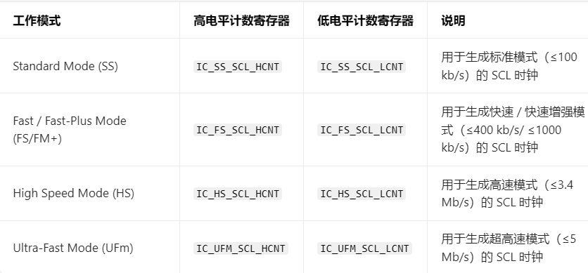

> 当 DW_apb_i2c 仅作为从机时，无需配置这些 *CNT 寄存器，因为从机不主动生成 SCL 时钟。

##### 关键的时序约束：

1. 偏斜（skew）约束时序偏斜必须满足：
`skew < T(SCL 低电平周期)−T(SU; DAT)`
这是为了保证数据建立时间（setup time）的要求，避免采样错误。
2. START/STOP/RESTART 时序总线缓冲时间（tBUF）以及 START、STOP、RESTART 条件的建立 / 保持时间，都依赖于对应模式下 *HCNT / *LCNT 寄存器的配置值。

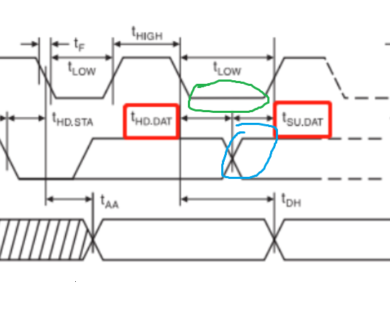

绿色部分为SCL低电平时间，蓝色部分为数据建立时间。
如果skew时间过长，skew时间+建立时间超过SCL低电平周期，则会影响SCL高电平时的采样，出现采样不稳定问题。

##### I2C 关键Timing参数 - *CNT 寄存器 
配置哪个寄存器，能控制哪个时序的长短。

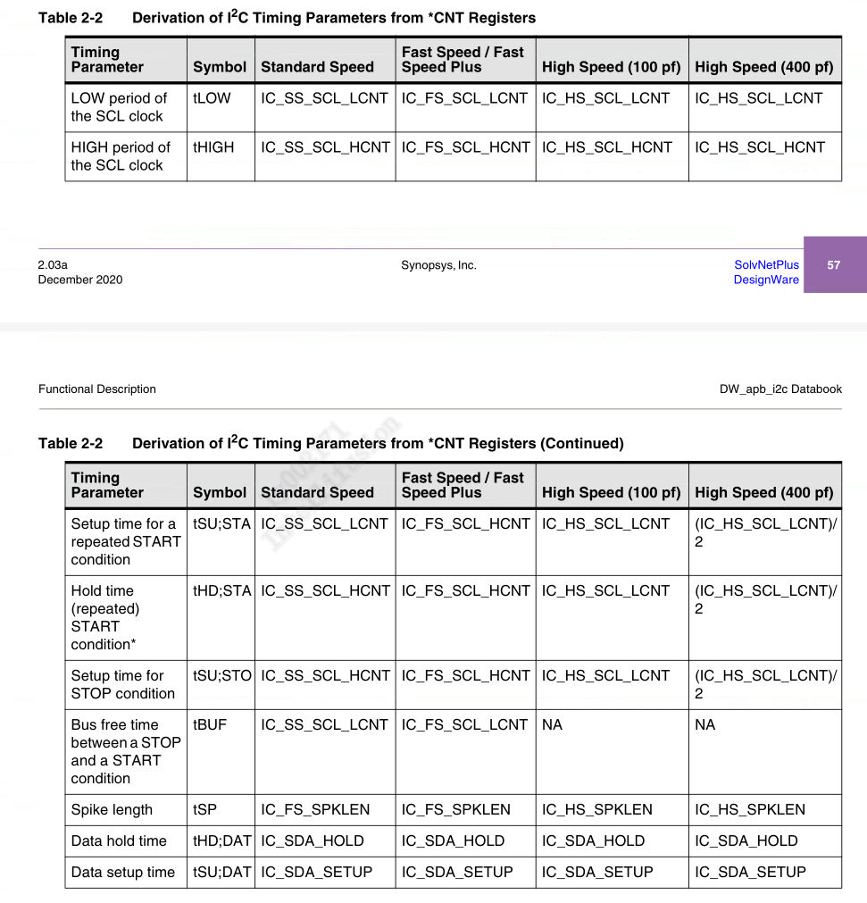

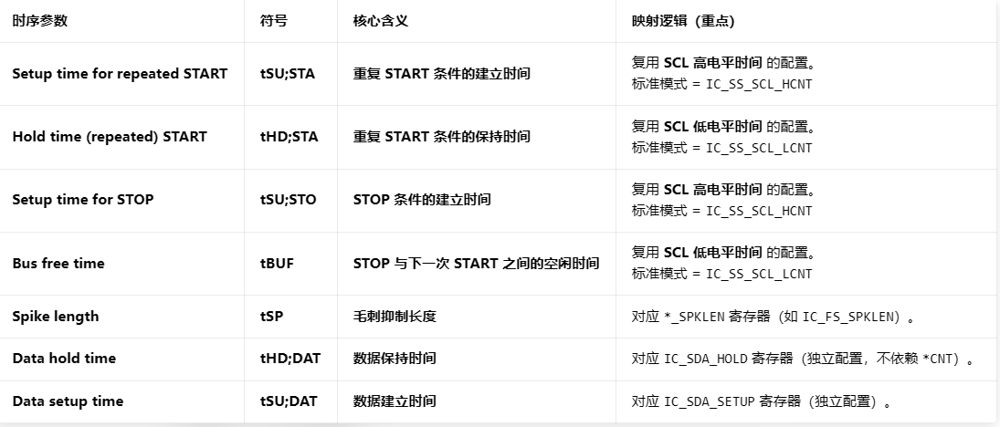


**高速模式（HS）的特殊规则**
注意表格中 High Speed (100 pF) 和 High Speed (400 pF) 列的特殊值：
对于 tLOW (低电平) 和 tSU;STO (建立时间)：使用 IC_HS_SCL_LCNT，但除以 2。
这意味着高速模式下，SCL 低电平时间和 STOP 建立时间被减半，以支持更高的传输速率（3.4Mb/s）。

**总结：工程师如何使用这张表？**
定目标：我要在 400kb/s 下通信。
查表：定位到 Fast Speed / Fast Speed Plus 列。
配寄存器：
根据目标周期，计算 IC_FS_SCL_LCNT 和 IC_FS_SCL_HCNT。
根据毛刺要求，设置 **IC_FS_SPKLEN**
查时序：验证时，查看表中对应值，确认时序是否满足 I²C 规范。

##### IC_CLK_FREQ_OPTIMIZATION = 0 时 的 最小值约束

当 DW_apb_i2c 作为主机，且 IC_CLK_FREQ_OPTIMIZATION = 0 时，*LCNT / *HCNT 寄存器的最小值约束，以及实际 SCL 高低电平时间的真实计算公式。

在 SS / FS / FM+ / HS 模式下，*LCNT 和 *HCNT 不能随便写，必须满足：
- *_LCNT 寄存器值 > *_SPKLEN + 7
- *_HCNT 寄存器值 > *_SPKLEN + 5
原因：
- *_LCNT + 7：SCL 下降沿后，**驱动 SDA 所需的时间开销**。
- *_HCNT + 5：SCL 高电平期间，**采样 SDA 所需的时间开销**。
- 
若不满足最小值，会导致内部逻辑无法在规定时间内完成驱动 / 采样，破坏 I²C 时序。

实际上SCL周期的生成逻辑
DW_apb_i2c 内部会对寄存器值做额外处理，生成真实的 SCL 高低电平：
- SCL 低电平时间：
内部计数：*_LCNT + 1 个 ic_clk 周期
再加上内部逻辑延迟（约 3 个 ic_clk），最终低电平周期至少为 9 个 ic_clk 周期（7+1+1）

- SCL 高电平时间：
内部计数：*_HCNT + IC_*_SPKLEN + 7 个 ic_clk 周期
这包含了：计数逻辑 (*_HCNT+1)、SCL 滤波延迟 (SPKLEN+2)、以及内部逻辑延迟（约 3 个 ic_clk），最终高电平周期至少为 13 个 ic_clk 周期（6+1+3+3）

外部因素的影响：
实际 SCL 高低电平时间，还会受到外部物理因素的影响，这些是芯片本身无法控制的：
- SCL 上升时间（rise time）：由上拉电阻、总线电容等决定。
- SCL 下降时间（fall time）：由 IO 驱动能力、总线电容等决定。

真实的 SCL 周期计算公式：

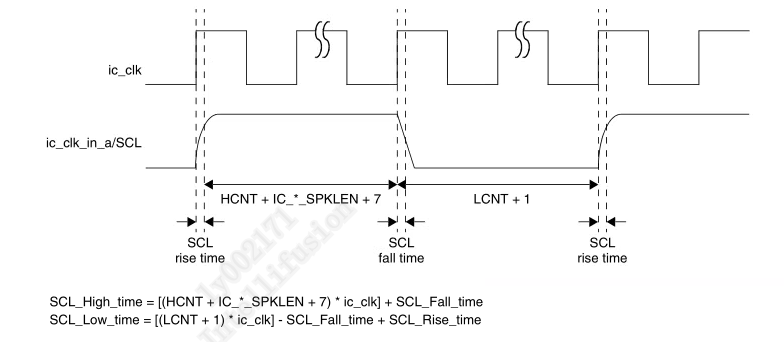

##### IC_CLK_FREQ_OPTIMIZATION = 1 时 的 最小值约束

IC_CLK_FREQ_OPTIMIZATION = 1 时，DW_apb_i2c 的 SCL 时序生成逻辑被 “简化”，寄存器最小值更宽松，

对比：
= 0：严格按文档前面讲的，必须满足 SPKLEN+7、SPKLEN+5 等约束。
= 1：不再增加固定周期开销，SCL 低电平 = LCNT，高电平 = HCNT + SPKLEN + 3。

1. IC_CLK_FREQ_OPTIMIZATION = 0（默认，严格模式）
这是早期版本的行为，内部逻辑会多加很多固定周期，导致：
`SCL 低电平时间 = (LCNT + 1) × ic_clk + 内部延迟（约 3 个周期）`
`SCL 高电平时间 = (HCNT + SPKLEN + 7) × ic_clk`
因此 LCNT 必须 > SPKLEN + 7
因此 HCNT 必须 > SPKLEN + 5
特点：
寄存器值不能太小
实际时序比寄存器值大很多
主要为了满足所有时序裕量

2. IC_CLK_FREQ_OPTIMIZATION = 1（优化模式）
内部逻辑不再增加 “固定额外周期”，更接近直接按寄存器值生成 SCL：
`SCL LOW period = IC_*_LCNT × ic_clk`
`SCL HIGH period = IC_*_HCNT × ic_clk + SPKLEN + 3`

并且有严格的最小值限制：
`IC_*_LCNT` 不能小于 6（硬件强制最小 = 6）
`IC_*_HCNT` 不能小于 1（硬件最小 = 5 个周期：1+1+3）

特点：
配置更简单
实际时序与寄存器值更接近
不再要求 SPKLEN + 7 / SPKLEN + 5 的约束
适合高频率 I²C（如 1M、3.4M、5M）

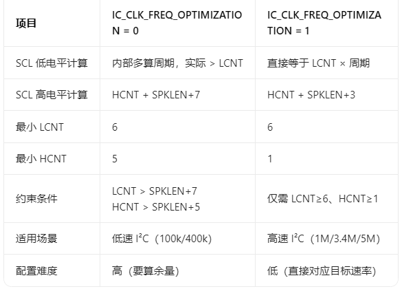

##### Fast Mode下的关键时序约束表格

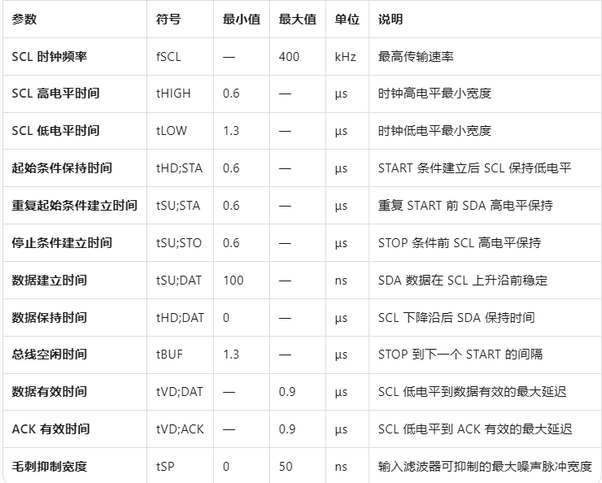

##### 计算案例：
ic_clk = 10MHz，目标I2C速率为800k

基础参数
ic_clk = 10 MHz → 周期 = 100 ns
目标速率 = 800 kbps
模式 = Fast Mode Plus

SPKLEN 计算（毛刺 50ns）

SPKLEN = 50ns / 100ns - 1 ≈ 0
→ 硬件最小 = 1
最终：**IC_FS_SPKLEN = 1**

LCNT / HCNT 计算（优化模式 =1）

SCL 低电平 ≈ 600ns
LCNT = 600 / 100 = 6
→ **IC_FS_SCL_LCNT = 6**

SCL 高电平 ≈ 600ns
HCNT = 600/100 - SPKLEN -3 = 6 -1 -3 = 2
→ **IC_FS_SCL_HCNT = 2**

这里两个600ns的来源：
从根本原因开始：800 kbps 的 SCL 周期是多少？
I²C 主机波特率 = 1 / SCL 周期
目标速率 = 800 kbpsSCL 周期 = 1 / 800,000 = 1250 ns
也就是说：整个 SCL 周期只有 1250 ns（高 + 低）
二、I²C 规范要求：高低电平必须对称
Fast Mode Plus (FM+) 规范：
SCL 高电平时间（tHIGH）≥ 600 ns
SCL 低电平时间（tLOW）≥ 600 ns
因为总周期 1250 ns，所以：
高 = 600 ns
低 = 650 ns 左右
实际最常用的配置 = 高低各 600 ns这就是为什么：
SCL 低电平 ≈ 600 ns
（而且 600 ns 是 I²C 规范的最小值底线）


最终可用配置

```
IC_FS_SPKLEN    = 1
IC_FS_SCL_LCNT  = 6
IC_FS_SCL_HCNT  = 2
```

##### dw_apb_i2c手册计算过程

**IC_CLK_FREQ_OPTIMIZATION = 0**

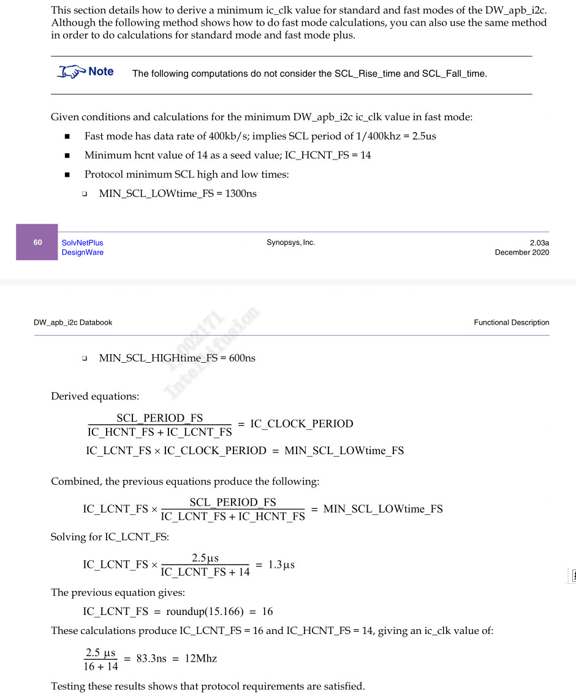

**IC_CLK_FREQ_OPTIMIZATION = 1**

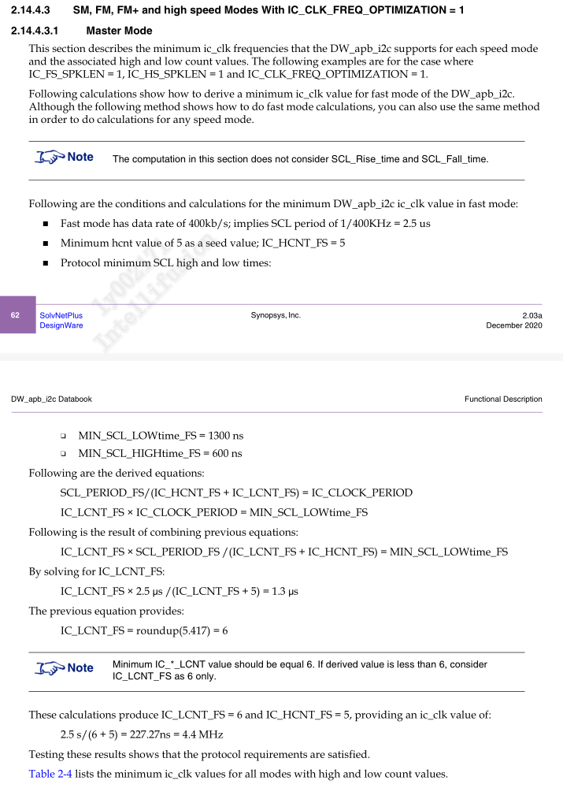

这是在 Fast Mode（400 kb/s） 且 IC_CLK_FREQ_OPTIMIZATION = 1（优化模式） 下，推导最小 ic_clk 频率的过程。
与之前的例子相比，核心差异在于：
- 初始种子值：IC_HCNT_FS = 5（之前是 14）
- 得到的寄存器值：IC_LCNT_FS = 6，IC_HCNT_FS = 5
- 最终最小 ic_clk 频率：4.4 MHz（之前是 12 MHz）
- 特殊约束：IC_LCNT_FS 必须 ≥ 6（优化模式下硬件强制最小值）

计算过程中：
计算结果 5.417 小于优化模式下 IC_LCNT_FS 的硬件最小值 6。文档明确指出：如果计算值小于 6，则必须取 6。
所以最终 IC_LCNT_FS=6


##### rise time和fall time的影响因素


##### ic_clk - high_cnt - low_cnt

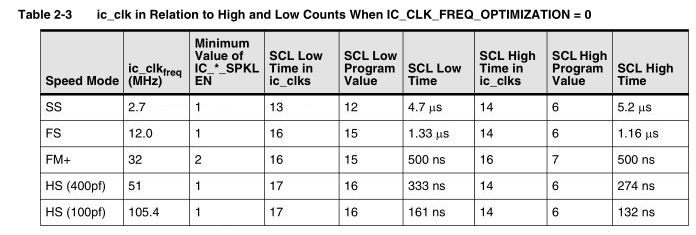

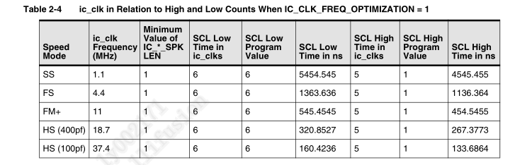

##### 其他模式

Ultra mode，Slave mode下的计算方式，参考控制器手册。


### Clocks & Resets

#### Clocks

- pclk: apb clock for bus interface unit
- ic_clk: peripheral clock on which dw_apb_i2c runs, clock transfer in standard, fast and high-speed mode

#### Resets

- 两个复位信号：presetn（APB 域）和 ic_rst_n（I2C 外设域）。
- 共同规则：都是 异步断言、同步释放。
- 关键约束：同步释放逻辑 不由 DW_apb_i2c 内部实现，必须由外部电路提供，否则会导致亚稳态或复位失败。

### SDA Hold Time

协议要求和板级考量：

- Standard / Fast Mode：I²C 协议要求 SDA 数据保持时间 tHD;DAT = 300 ns。
- High Speed / Fast Mode Plus：要求更长的保持时间，以跨越 SCL 下降沿前后的逻辑电平不确定区。
- 板级延迟（走线、驱动等）会导致实际保持时间与理论值不符，因此需要硬件支持动态调整。

IC_SDA_HOLD 寄存器的作用：
DW_apb_i2c 提供了一个 可编程寄存器 IC_SDA_HOLD，用于精确控制 SDA 的保持时间，解决板级差异带来的时序问题。(补偿板级走线延迟，保证在任何物理条件下都满足 I²C 时序规范。)

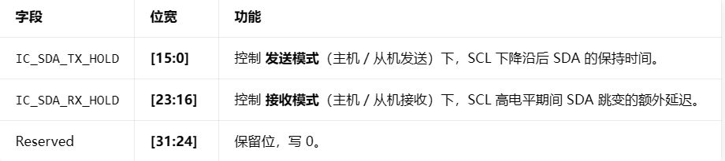

使用规则：
- 模式切换时需重编程：
不同速度模式（SS/FS/FM+/HS）需要不同的保持时间，因此切**换模式时必须重新配置 IC_SDA_HOLD**。
- 写入条件：
只能在 DW_apb_i2c 禁用（IC_ENABLE[0] = 0）时写入，避免传输中时序突变。
- 默认值：
复位值由 coreConsultant 参数 IC_DEFAULT_SDA_HOLD 预配置，可在生成 IP 时定制。

##### SDA HOLD Timing In Recevier

IC_SDA_HOLD的单位是一个ic_clk时钟周期，最小值是0

下面时序的行为：
1. scl_int 保持高电平时，sda_post_spk_suppression 发生跳变。
2. sda_int 不会立刻跟随跳变，而是延迟 IC_SDA_RX_HOLD 个 ic_clk 周期 后再跳变。
3. 这个延迟就是 接收端的 SDA 保持时间，用于补偿板级延迟，保证 SCL 采样时数据稳定。

如下图IC_SDA_RX_HOLD只在SCL为高的情况下有效，SCL为低时，IC_SDA_RX_HOLD剩余周期(>=3部分)无效。

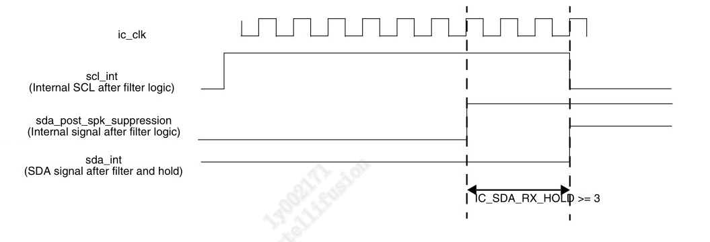

如下图IC_SDA_RX_HOLD = 2，不会超过SCL高电平所在范围。

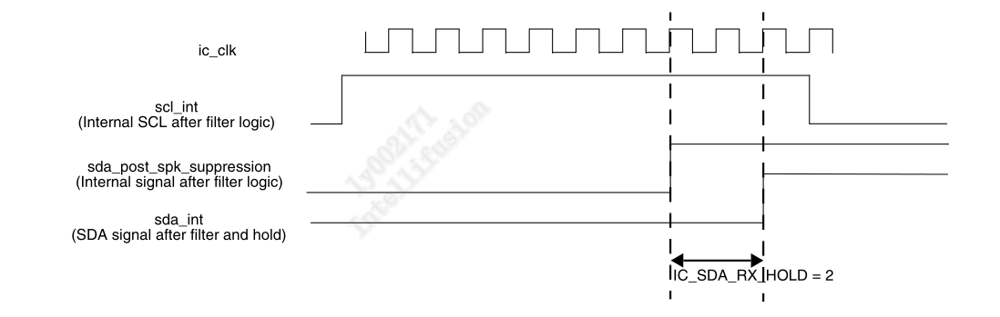

最大值限制：

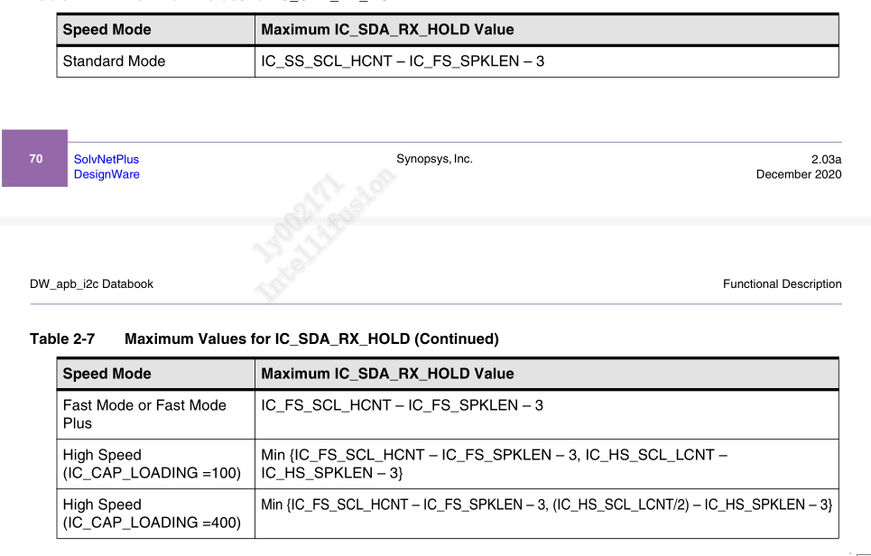

##### SDA HOLD Timing In Transmitter

**IC_SDA_TX_HOLD** 是 DW_apb_i2c **发送模式**下，用于控制 **SDA 数据保持时间（tHD;DAT）**的可编程寄存器，单位为 1 个 ic_clk 周期。它**决定了 SCL 拉低后，SDA 延迟多久再跳变**，以满足 I²C 协议对数据保持时间的要求。（本质是发送端的数据保持时间补偿机制）

###### 主机模式（Master Mode）行为
- 最小 tHD;DAT：固定为 1 个 ic_clk 周期，即使 IC_SDA_TX_HOLD = 0，SDA 也会在 SCL 拉低后延迟 1 个 ic_clk 周期再变化。
- 通用规则：当 IC_SDA_TX_HOLD ≥ 1 时，SDA 会在 SCL 拉低后，延迟 IC_SDA_TX_HOLD 个 ic_clk 周期 再驱动跳变。
- 时序示例（IC_SDA_TX_HOLD = 3）
ic_clk_oe（SCL 驱动）拉低后，经过 3 个 ic_clk 周期，ic_data_oe（SDA 驱动）才发生跳变，这 3 个周期就是配置的 tHD;DAT。

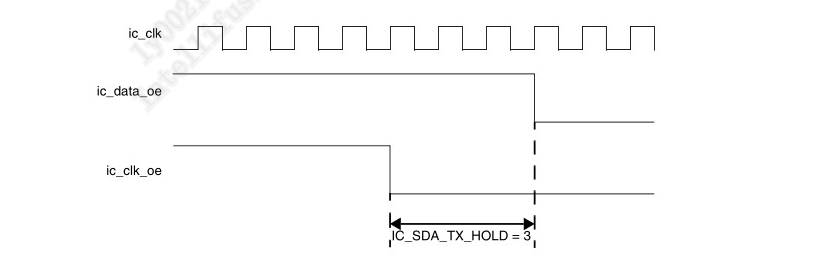

###### 从机模式（Slave Mode）行为
- 最小 tHD;DAT：固定为 SPKLEN + 7 个 ic_clk 周期，其中：
SS/FS/FM+ 模式：SPKLEN = IC_FS_SPKLEN
- HS 模式：SPKLEN = IC_HS_SPKLEN
即使 IC_SDA_TX_HOLD < SPKLEN + 7，硬件也会强制延迟 SPKLEN + 7 个周期，用于同步和毛刺抑制。
- 通用规则：当 IC_SDA_TX_HOLD ≥ SPKLEN + 7 时，SDA 会在 SCL 输入拉低后，延迟 IC_SDA_TX_HOLD 个 ic_clk 周期 再驱动跳变。

### DMA Interface

DW_apb_i2c 内置可选 DMA 功能，通过握手接口与 DMA 控制器（**推荐搭配 DesignWare DW_ahb_dmac**）协作，实现 I²C 数据的高效批量传输，减轻 CPU 负载。数据传输通过 APB 总线完成，接口设计通用化，可适配各类 DMA 控制器。

#### 关键特性与约束

1. DMA 类型与行为
- 搭配 DW_ahb_dmac 时，DMA 为流控制器（flow controller），由软件在 DW_ahb_dmac CTLx 寄存器中编程块大小（BLOCK_TS）。
- 优先使用 DMA 突发传输（burst transactions） 提升效率，其他 DMA 控制器行为类似。
2. 状态信号说明
- dma_finish 信号用于指示块传输完成，但 DW_apb_i2c 不使用该信号，因此未出现在 I/O 端口列表中。

#### DMA接口使能方式

通过 IC_DMA_CR（DMA 控制寄存器） 使能对应方向的握手接口：
- 发送方向：向 TDMAE 位写 1，使能 I²C 发送 DMA 握手。
- 接收方向：向 RDMAE 位写 1，使能 I²C 接收 DMA 握手。


#### DMA 操作流程概览

1. 处理器配置阶段
在 DW_ahb_dmac 的 **CTLx** 寄存器中：
**BLOCK_TS：配置** I²C 要传输的总数据块大小（数据项数量）。
**SRC_MSIZE / DEST_MSIZE**：配置单次突发传输长度（即**每次 DMA 请求传输的 FIFO 条目数**）。
2. 块传输拆分
总数据块会被**拆分为多次突发传输**，每次由 DW_apb_i2c 发起请求。
示例：**块大小 = 12，突发长度 = 4 → 需发起 3 次 DMA 请求，完成全部 12 个数据项的读写**。
3. 数据交互
- 发送请求：DMA 向 I²C TX FIFO 写入突发长度的数据。
- 接收请求：DMA 从 I²C RX FIFO 读出突发长度的数据。

DMA 配置-作用 列表
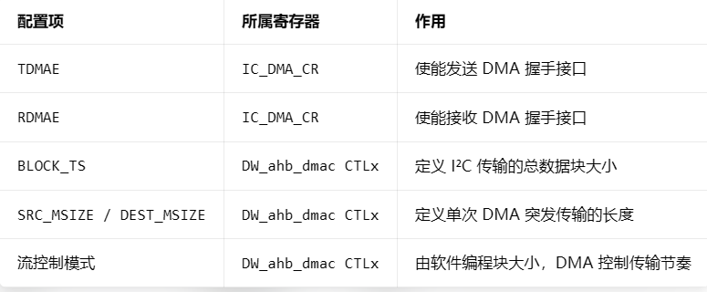

数据块拆分示例，**倍数**：
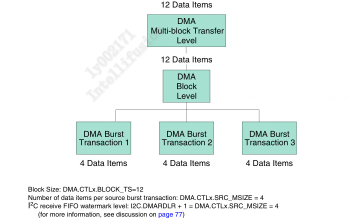

数据块拆分示例，**非倍数**：
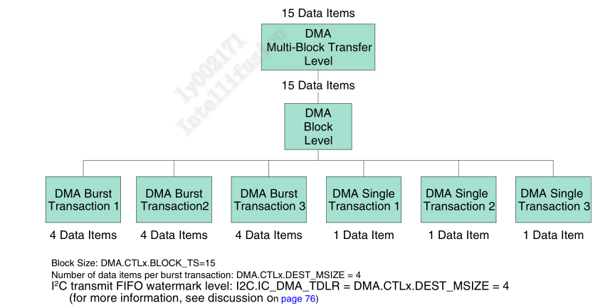

#### 传输水线级别 和 传输FIFO下溢

我们知道IC_EMPTYFIFO_HOLD_MASTER_EN配置用于决定TX FIFO为空时，控制器是否生成STOP信号。IC_EMPTYFIFO_HOLD_MASTER_EN = 0时，如果DMA的水线级别设置不好，很容易导致I2C总线上频繁出现STOP信号，降低总线效率。

`TX DATA -> DMA -> I2C TX FIFO -> I2C BUS -> DEV`

TX FIFO就是水箱，DMA是往水箱加水的，I2C时从水箱取水的。 
DMA TDLR寄存器设置水线，设置的约高，也就是提醒服务员(DMA)在剩余水量多的时候，就立即加水(所需水量相同的情况下，水线越高，每次补水的量就越少，需要补水次数就越多)

比如：
- TDLR = 6（高水位）：水杯里还剩 6 口时就喊服务员倒水
此时水杯里还有 6 口，足够你喝很久
服务员有充足时间倒 2 口进来
你永远喝不到空杯 → 下溢概率低
- TDLR = 2（低水位）：水杯里只剩 2 口时才喊服务员
只剩 2 口，很快就会喝光
服务员要倒 6 口，动作稍慢你就喝到空杯了 → 下溢概率高

硬件层面的本质：
- TDLR 越大：FIFO 剩余数据还很多时就触发 DMA，“安全余量” 更大
I2C 发送完剩余数据需要的时间更长
DMA 有足够时间完成 burst 填充
- TDLR 越小：FIFO 快空了才触发 DMA，“安全余量” 极小
剩余数据很快被发完
**DMA 响应稍有延迟就会 FIFO 空 → underflow**

为什么 “每次 burst 越小、突发次数越多” 反而更安全？
这是高水位配置的必然结果：
`TDLR ↑ → DEST_MSIZE = FIFO_DEPTH - TDLR ↓`
每次 DMA 只搬少量数据（比如 2 个），但触发更频繁（15 次）
**好处：**
DMA 每次处理的数据量小，总线占用时间短，更容易被调度执行
触发更早，FIFO 还有大量数据时就开始填充，永远不会见底
即使某次 DMA 响应慢一点，FIFO 里还有足够数据撑到下一次填充
**本质：用 “更频繁的小搬运” 换取 “更高的安全冗余”，牺牲总线效率换传输可靠性。**

DMA 响应变快的原因是什么？
这里的 “响应变快” 不是指 DMA 硬件速度提升，而是系统层面更容易及时处理请求，原因有两点：
1. 单次 burst 数据量小 → 总线占用时间短
小 burst（比如 2 个数据）在 AMBA 总线上传输时间更短
总线仲裁器更容易在短时间内把使用权交给 DMA
不容易被其他高优先级主设备（如 CPU、其他 DMA）长时间抢占
整体表现为：**DMA 请求更容易被快速响应**
2. 触发时机更早 → 时间窗口更充裕
高水位触发时，FIFO 还有大量数据（比如 6 个）
I2C 发送完这些数据需要 6 × 8/bit_rate 时间
相比低水位（只剩 2 个数据，时间窗口只有 1/3），DMA 有3 倍以上的时间去完成填充
即使系统负载高、总线繁忙，也更大概率在 FIFO 空之前完成填充

水线高低设置对比：
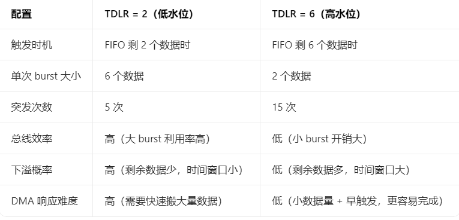

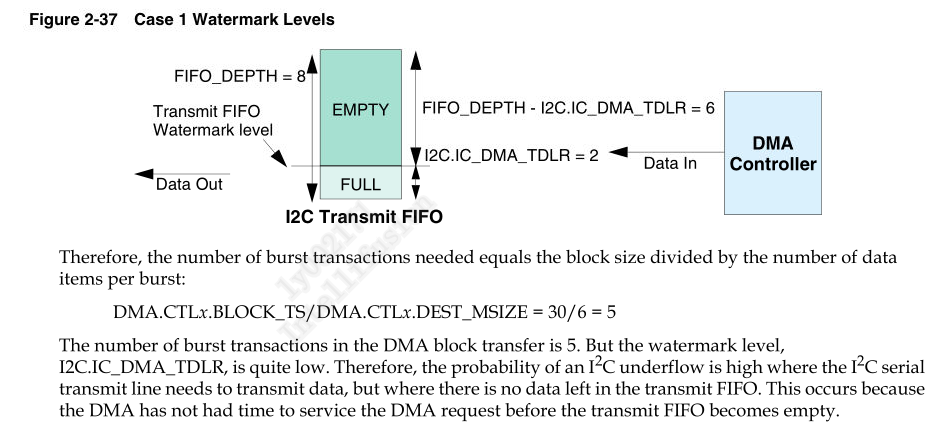

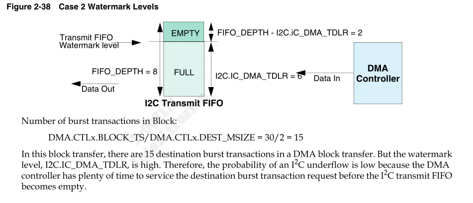


#### 发送方向：DEST_MSIZE 与 TX FIFO 溢出控制

1. 溢出风险与约束公式
当 DMA.CTLx.DEST_MSIZE > TX FIFO 剩余空间时，会发生 FIFO 溢出（Overflow），即数据写入超过 FIFO 容量导致数据丢失。为避免溢出，必须满足：
DMA.CTLx.DEST_MSIZE≤I2C.FIFO_DEPTH−I2C.IC_DMA_TDLR
I2C.FIFO_DEPTH：TX FIFO 总深度
I2C.IC_DMA_TDLR：发送水位阈值（FIFO ≤ 该值时触发 DMA）
右侧值：触发 DMA 时 TX FIFO 的剩余空闲空间
2. 最优配置（平衡效率与安全）
为最大化总线利用率、减少突发次数，最优配置为：
DMA.CTLx.DEST_MSIZE=I2C.FIFO_DEPTH−I2C.IC_DMA_TDLR
此时 DMA 突发长度恰好等于 FIFO 剩余空间，既不会溢出，也能让每次填充量最大。
3. 特殊说明
若在 DMA 突发传输期间，I²C 已成功发送 ≥1 个数据，则 FIFO 不会被填满（因为发送消耗了空间）。


#### 接收方向：RX FIFO 水位与溢出 / 下溢控制

1. 接收 DMA 请求触发逻辑
当 RX FIFO 条目数 ≥ IC_DMA_RDLR + 1 时，DW_apb_i2c 向 DMA 发起接收请求，DMA 会读取长度为 CTLx.SRC_MSIZE 的突发数据。
若 DMA **不及时读取**，RX FIFO 会被填满 → **溢出**（Overflow）
若 **SRC_MSIZE 配置过大**，可能导致 FIFO 被读空 → **下溢**（Underflow）
2. 水位选择的权衡
接收水位 IC_DMA_RDLR + 1 的选择逻辑与发送端一致：
高水位：更早触发 DMA，溢出概率更低，但突发次数更多、总线利用率更低
低水位：减少突发次数、提升总线效率，但溢出概率更高
3. 下溢风险与约束公式
为避免 RX FIFO 下溢（读空），必须满足：
`DMA.CTLx.SRC_MSIZE=I2C.IC_DMA_RDLR+1`

此时**DMA 突发长度等于触发请求时 FIFO 的数据量，刚好读完水位以上数据，不会读空**
该配置同时减少了突发次数，提升了 AMBA 总线利用率

4. 特殊说明
若在 DMA 突发读取期间，I²C 已成功接收 ≥1 个数据，则 RX FIFO 不会被读空（因为接收补充了数据）。

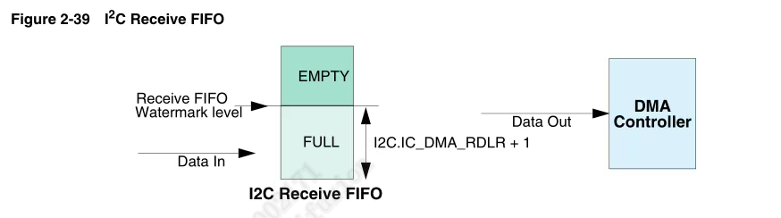

#### DMA握手信号

不做解析，简单看看。验证遇到问题再看。

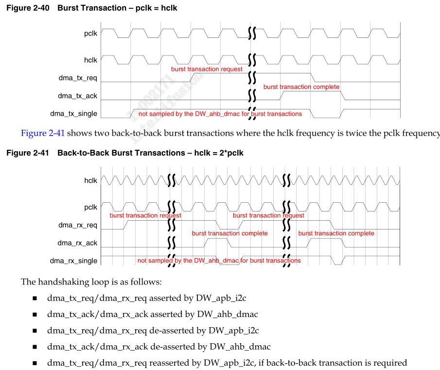

### Signals

#### Interrupt信号
TODO

#### I2C信号

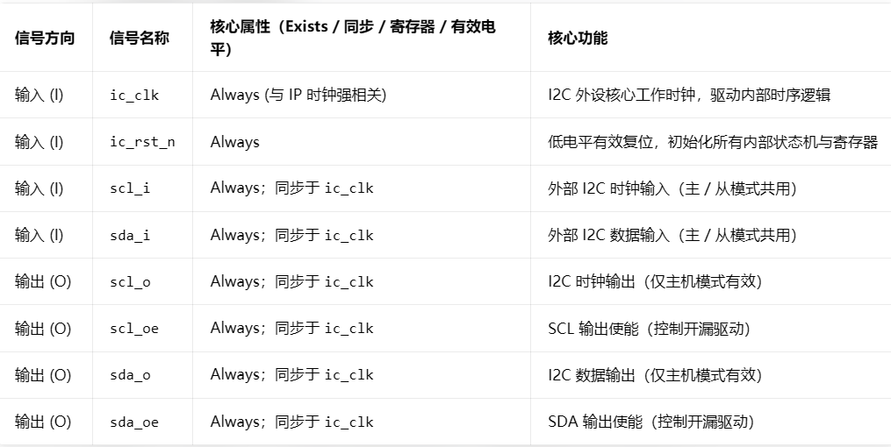

#### DMA信号
TODO
