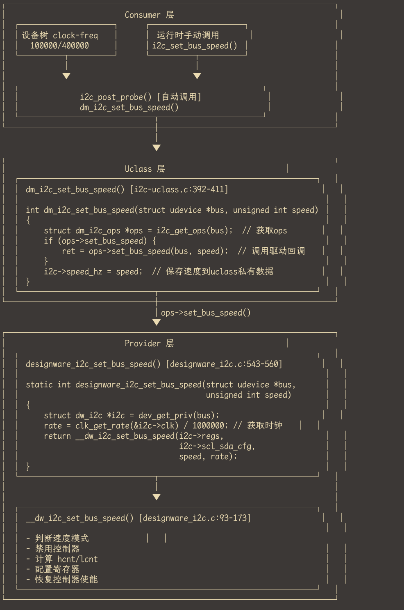

# 简介

本文主要是针对新思的I2C控制器的学习的第二篇文章

本文涉及:
Uboot下I2C控制器驱动实现分析

# OPS

```
static const struct dm_i2c_ops designware_i2c_ops = {
	.xfer		= designware_i2c_xfer,
	.probe_chip	= designware_i2c_probe_chip,
	.set_bus_speed	= designware_i2c_set_bus_speed,
};

static const struct udevice_id designware_i2c_ids[] = {
	{ .compatible = "snps,designware-i2c" },
	{ }
};

U_BOOT_DRIVER(i2c_designware) = {
	.name	= "i2c_designware",
	.id	= UCLASS_I2C,
	.of_match = designware_i2c_ids,
	.bind	= designware_i2c_bind,
	.probe	= designware_i2c_probe,
	.priv_auto_alloc_size = sizeof(struct dw_i2c),
	.remove = designware_i2c_remove,
	.flags = DM_FLAG_OS_PREPARE,
	.ops	= &designware_i2c_ops,
};
```

# I2C驱动回调接口

## designware_i2c_xfer

根据msg里的flags来决定具体执行read还是write接口
```
static int designware_i2c_xfer(struct udevice *bus, struct i2c_msg *msg,
			       int nmsgs)
{
	struct dw_i2c *i2c = dev_get_priv(bus);
	int ret;

	debug("i2c_xfer: %d messages\n", nmsgs);
	for (; nmsgs > 0; nmsgs--, msg++) {
		debug("i2c_xfer: chip=0x%x, len=0x%x\n", msg->addr, msg->len);
		if (msg->flags & I2C_M_RD) {
			ret = __dw_i2c_read(i2c->regs, msg->addr, 0, 0,
					    msg->buf, msg->len);
		} else {
			ret = __dw_i2c_write(i2c->regs, msg->addr, 0, 0,
					     msg->buf, msg->len);
		}
		if (ret) {
			debug("i2c_write: error sending\n");
			return -EREMOTEIO;
		}
	}

	return 0;
}

```

```
/*
 * i2c_wait_for_bb - Waits for bus busy
 *
 * Waits for bus busy
 */
static int i2c_wait_for_bb(struct i2c_regs *i2c_base)
{
	unsigned long start_time_bb = get_timer(0);

	while ((readl(&i2c_base->ic_status) & IC_STATUS_MA) ||
	       !(readl(&i2c_base->ic_status) & IC_STATUS_TFE)) {

		/* Evaluate timeout */
		if (get_timer(start_time_bb) > (unsigned long)(I2C_BYTE_TO_BB))
			return 1;
	}

	return 0;
}

static int i2c_xfer_init(struct i2c_regs *i2c_base, uchar chip, uint addr,
			 int alen)
{
	if (i2c_wait_for_bb(i2c_base))
		return 1;

	i2c_setaddress(i2c_base, chip);
	while (alen) {
		alen--;
		/* high byte address going out first */
		writel((addr >> (alen * 8)) & 0xff,
		       &i2c_base->ic_cmd_data);
	}
	return 0;
}
```

read接口导读:
```
static int __dw_i2c_read(struct i2c_regs *i2c_base, u8 dev, uint addr,
			 int alen, u8 *buffer, int len)
{
	unsigned long start_time_rx;
	unsigned int active = 0;

#ifdef CONFIG_SYS_I2C_EEPROM_ADDR_OVERFLOW
	/*
	 * EEPROM chips that implement "address overflow" are ones
	 * like Catalyst 24WC04/08/16 which has 9/10/11 bits of
	 * address and the extra bits end up in the "chip address"
	 * bit slots. This makes a 24WC08 (1Kbyte) chip look like
	 * four 256 byte chips.
	 *
	 * Note that we consider the length of the address field to
	 * still be one byte because the extra address bits are
	 * hidden in the chip address.
	 */
	dev |= ((addr >> (alen * 8)) & CONFIG_SYS_I2C_EEPROM_ADDR_OVERFLOW);
	addr &= ~(CONFIG_SYS_I2C_EEPROM_ADDR_OVERFLOW << (alen * 8));

	debug("%s: fix addr_overflow: dev %02x addr %02x\n", __func__, dev,
	      addr);
#endif

	if (i2c_xfer_init(i2c_base, dev, addr, alen))
		return 1;

	start_time_rx = get_timer(0);
	while (len) {
		if (!active) {
			/*
			 * Avoid writing to ic_cmd_data multiple times
			 * in case this loop spins too quickly and the
			 * ic_status RFNE bit isn't set after the first
			 * write. Subsequent writes to ic_cmd_data can
			 * trigger spurious i2c transfer.
			 */
			if (len == 1)
				writel(IC_CMD | IC_STOP, &i2c_base->ic_cmd_data);
			else
				writel(IC_CMD, &i2c_base->ic_cmd_data);
			active = 1;
		}

		if (readl(&i2c_base->ic_status) & IC_STATUS_RFNE) {
			*buffer++ = (uchar)readl(&i2c_base->ic_cmd_data);
			len--;
			start_time_rx = get_timer(0);
			active = 0;
		} else if (get_timer(start_time_rx) > I2C_BYTE_TO) {
			return 1;
		}
	}

	return i2c_xfer_finish(i2c_base);
}

```


## designware_i2c_probe_chip

## designware_i2c_set_bus_speed

整体架构：




## 超时机制

超时处理机制详解

  该驱动中有多个关键的超时检查点，防止在异常情况下系统死锁。

  1. 控制器使能/禁用超时 (第64-84行)
```
  static int dw_i2c_enable(struct i2c_regs *i2c_base, bool enable)
  {
      u32 ena = enable ? IC_ENABLE_0B : 0;
      int timeout = 100;

      do {
          writel(ena, &i2c_base->ic_enable);
          if ((readl(&i2c_base->ic_enable_status) & IC_ENABLE_0B) == ena)
              return 0;

          /*
           * Wait 10 times the signaling period of the highest I2C
           * transfer supported by the driver (for 400KHz this is
           * 25us) as described in the DesignWare I2C databook.
           */
          udelay(25);
      } while (timeout--);
      printf("timeout in %sabling I2C adapter\n", enable ? "en" : "dis");

      return -ETIMEDOUT;
  }
```
  目的：使能/禁用控制器时，硬件可能需要时间响应，通过轮询 ic_enable_status 寄存器确认状态变化。

  机制：
  - 最多重试 100 次
  - 每次间隔 25µs（400KHz I2C 信号周期的 10 倍）
  - 总超时时间约 2.5ms

---
  2. 等待总线空闲超时 (第208-221行)
```
  static int i2c_wait_for_bb(struct i2c_regs *i2c_base)
  {
      unsigned long start_time_bb = get_timer(0);

      while ((readl(&i2c_base->ic_status) & IC_STATUS_MA) ||
             !(readl(&i2c_base->ic_status) & IC_STATUS_TFE)) {

          /* Evaluate timeout */
          if (get_timer(start_time_bb) > (unsigned long)(I2C_BYTE_TO_BB))
              return 1;
      }

      return 0;
  }
```
  目的：等待总线从忙碌状态变为空闲。

  检查条件：
  - IC_STATUS_MA：总线是否被占用
  - IC_STATUS_TFE：TX FIFO 是否为空

  超时时间：I2C_BYTE_TO_BB（通常定义为毫秒级）

  ---
  3. 等待停止条件超时 (第239-260行)
```
  static int i2c_xfer_finish(struct i2c_regs *i2c_base)
  {
      ulong start_stop_det = get_timer(0);

      while (1) {
          if ((readl(&i2c_base->ic_raw_intr_stat) & IC_STOP_DET)) {
              readl(&i2c_base->ic_clr_stop_det);
              break;
          } else if (get_timer(start_stop_det) > I2C_STOPDET_TO) {
              break;
          }
      }

      if (i2c_wait_for_bb(i2c_base)) {
          printf("Timed out waiting for bus\n");
          return 1;
      }

      i2c_flush_rxfifo(i2c_base);

      return 0;
  }
```
  目的：等待 I2C 停止条件检测完成。

  机制：
  - 轮询 ic_raw_intr_stat 的 IC_STOP_DET 位
  - 超时后跳出循环继续执行（不会无限等待）
  - 再检查总线是否空闲

  ---
  4. 读操作字节超时 (第300-325行)
```
  start_time_rx = get_timer(0);
  while (len) {
      if (!active) {
          if (len == 1)
              writel(IC_CMD | IC_STOP, &i2c_base->ic_cmd_data);
          else
              writel(IC_CMD, &i2c_base->ic_cmd_data);
          active = 1;
      }

      if (readl(&i2c_base->ic_status) & IC_STATUS_RFNE) {
          *buffer++ = (uchar)readl(&i2c_base->ic_cmd_data);
          len--;
          start_time_rx = get_timer(0);  // 重置计时器
          active = 0;
      } else if (get_timer(start_time_rx) > I2C_BYTE_TO) {
          return 1;  // 超时返回错误
      }
  }
```
  目的：读取每个字节时防止从机无响应。

  机制：
  - 每成功读取一个字节，重置计时器
  - 若在 I2C_BYTE_TO 时间内未收到数据，返回错误

  ---
  5. 写操作字节超时 (第368-384行)

  start_time_tx = get_timer(0);
  while (len) {
      if (readl(&i2c_base->ic_status) & IC_STATUS_TFNF) {
          if (--len == 0) {
              writel(*buffer | IC_STOP, &i2c_base->ic_cmd_data);
          } else {
              writel(*buffer, &i2c_base->ic_cmd_data);
          }
          buffer++;
          start_time_tx = get_timer(0);  // 重置计时器

      } else if (get_timer(start_time_tx) > (nb * I2C_BYTE_TO)) {
          printf("Timed out. i2c write Failed\n");
          return 1;
      }
  }

  目的：写入数据时等待 TX FIFO 有空间。

  特点：超时时间与写入字节数 nb 成正比，写越多数据等待越久。

  ---
  超时处理总结图

  ┌─────────────────────────────────────────────────────────────┐
  │                    I2C 传输流程                              │
  ├─────────────────────────────────────────────────────────────┤
  │                                                             │
  │  dw_i2c_enable() ────► [使能超时 2.5ms]                     │
  │         │                                                   │
  │         ▼                                                   │
  │  i2c_wait_for_bb() ──► [总线空闲超时 I2C_BYTE_TO_BB]        │
  │         │                                                   │
  │         ▼                                                   │
  │  i2c_xfer_init() ─────► 设置从机地址                        │
  │         │                                                   │
  │         ▼                                                   │
  │  ┌─────读/写循环─────┐                                      │
  │  │                   │                                      │
  │  │  每字节超时检查   │◄── [I2C_BYTE_TO 或 nb*I2C_BYTE_TO]   │
  │  │                   │                                      │
  │  └───────────────────┘                                      │
  │         │                                                   │
  │         ▼                                                   │
  │  i2c_xfer_finish() ──► [停止条件超时 I2C_STOPDET_TO]        │
  │         │                 [总线空闲超时]                     │
  │         ▼                                                   │
  │  i2c_flush_rxfifo() ─► 清空 FIFO                            │
  │                                                             │
  └─────────────────────────────────────────────────────────────┘

  为什么需要这些超时？
  ┌────────────────┬──────────────────────────────────┬──────────────────┐
  │      场景      │             可能原因             │    无超时后果    │
  ├────────────────┼──────────────────────────────────┼──────────────────┤
  │ 控制器使能失败 │ 硬件故障、时钟未使能             │ 系统卡死         │
  ├────────────────┼──────────────────────────────────┼──────────────────┤
  │ 总线一直忙碌   │ 从机拉低 SCL/SDA、其他主设备占用 │ 无限等待         │
  ├────────────────┼──────────────────────────────────┼──────────────────┤
  │ 读字节超时     │ 从机无响应、总线断开             │ 死循环           │
  ├────────────────┼──────────────────────────────────┼──────────────────┤
  │ 停止条件未检测 │ 总线错误、仲裁丢失               │ 无法开始下次传输 │
  └────────────────┴──────────────────────────────────┴──────────────────┘
  这种多层超时设计确保了任何异常情况都不会导致系统完全卡死，而是返回错误码让上层决定如何处理（如重试、报错、复位控制器等）。
