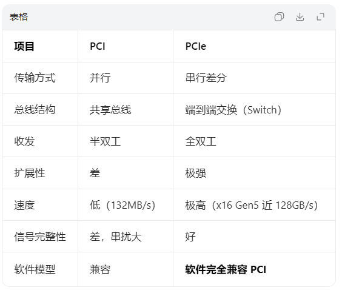

# 本文简介
本文主要介绍pci/pcie的基本特征，pci发展到pcie的历史背景，pcie的应用场景。简要介绍PCIe与CPU IO体系结构的关系。

# PCI 和 PCIe

PCI = Peripheral Component Interconnect
早期电脑里最经典的并行总线，白色长插槽那种。
核心特点
- 并行：32bit / 64bit 数据同时发
- 共享总线：所有设备抢一条通道
- 半双工：不能同时收 + 发
- 时钟低：33MHz / 66MHz
- 速度慢：32bit@33MHz 只有 132MB/s
  
PCI存在的问题
- 速度上不去
- 并行线之间串扰，频率一高就乱
- 多设备抢带宽，越插越卡
- 不支持热插拔
- 布线难、占用空间大
  
PCI到PCIe的进化：
时代背景（关键推动）
- 显卡越来越快
- AGP 很快不够用
- 硬盘进入 SATA、SSD 时代
- 存储吞吐量暴涨
- 网卡进入万兆时代
- 服务器需要多设备并发
- 并行总线频率无法再提升
- 线间干扰、同步时钟做不上去
于是业界决定：抛弃并行，走高速串行 + 差分信号 + packet 交换
→ 这就是 PCIe。

PCI和PCIe之间的显著区别：

PCIe 只是物理层 / 链路层革命，软件层兼容 PCI。

主要应用场景：
1. 显卡（最典型）
PCIe x16
Gen3/Gen4/Gen5
2. SSD / NVMe
PCIe x4
现在主流 Gen4
3. 网卡
千兆 / 万兆 / 25G/100G 网卡
全都走 PCIe
4. 服务器 CPU 互联
UPI、CXL 本质都是 PCIe 物理层变种
5. 嵌入式 / 主控芯片
现在做的嵌入式设备，基本都用 PCIe：
- 连接 AI 芯片
- 连接 SSD
- 连接 Ethernet Switch
- 连接 DSP、ASIC
- 板间互联
6. 工业 / 车载 / 存储
- U.2
- M.2
- OCuLink
- MiniSAS HD
- 都基于 PCIe
7. 芯片内部总线
很多现代 SoC 内部模块互联也用 PCIe 架构

# PCIe与CPU IO体系结构的关系
PCIe不是一个外设总线，相对SPI，I2C，UART这类外设总线来说，PCIe是CPU IO 体系的拓展。
它本质就是 CPU 内部那套 “访存 + 中断 + DMA” 机制的向外延伸。

1. 先看 CPU 本身的 IO 体系是什么？
CPU 要和外部通信，只靠 3 样东西：
- 地址总线：我要访问谁
- 数据总线：我要读写什么
- 控制总线：读 / 写 / 中断 / DMA 时序
CPU 对外的能力就三件事：
- 读 / 写（Memory/IO 空间）
- 中断（设备告诉 CPU：我好了）
- DMA（设备直接读写内存）
这就是 CPU 原生 IO 体系。

2. PCI / PCIe 做的事 = 把 CPU IO 体系 “延长” 出去
PCIe 没有发明新东西，它只是把 CPU 内部那套逻辑，用高速串行方式重新实现了一遍。
对应关系是 1:1 的：
- CPU 内部 ↔ PCIe 外部
- CPU 地址空间 → PCIe BAR 地址空间
- CPU 读写指令 → PCIe TLP 读写包
- CPU 中断 → PCIe MSI/MSI‑X
- CPU 控制总线 → PCIe 配置空间 / AER / 电源管理
- CPU 内存 → PCIe DMA 直接访问
PCIe 就是 CPU 把自己的 “手脚” 延长到外部设备。

3. 为什么叫「拓展」，而不是「外设接口」？
因为：PCIe 设备对 CPU 来说 = 一段内存
   - 设备寄存器 → 映射成物理地址
   - CPU 用 ioremap / pci_iomap 访问

    读写就像访问内存一样

   - CPU 根本不觉得它是 “外部设备”，只觉得是自己地址空间的一部分。

这就是 CPU IO 体系的自然延伸。

PCIe 用的是 CPU 的事务模型
- CPU 发一个读 → 生成一个 Read TLP
- 设备返回数据 → Completion TLP
完全和 CPU 内部总线行为一致，PCIe 是 CPU 内部总线的 “外部版”。

中断、DMA 全是 CPU 机制的拓展
- MSI‑X = 直接写 CPU 内存触发中断
- DMA = 设备直接访问 CPU 物理内存
- ATS/PRI = 设备共享 CPU MMU

PCIe 设备几乎拥有和 CPU 内部模块同等的访问能力。