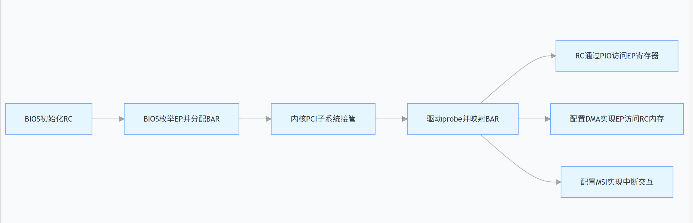

# 简介
本文介绍PCIe软件(Linux内核下)相关的部分。PCIe设备有两种可能的角色：RC和EP。两种角色所对应的软件实现差异很大。RC与EP的职责，以及所需要负责的事务皆有差异。文章会介绍RC的工作流，职责，EP的职责。以一个服务器与AI加速卡的场景，来介绍RC如何枚举EP，RC如何访问EP，EP如何访问RC。当然还包括这些事务发生之前的，RC与EP之间的内存映射配置过程等。
我觉得，这篇文章的命名应该改为：
《从枚举到交互：SoC PCIe RC 与 EP 的完整软件实战流程》

硬件环境介绍：
主机： 某x86架构服务器
设备： 某AI加速卡(Controller IP为Cadence)

主要过程：

核心目标：
从硬件启动到数据传输，完整讲解R**C 如何发现 EP→系统如何配置 EP→RC 与 EP 如何双向访问**的全流程，覆盖枚举、配置、PIO 读写、DMA 传输、MSI 中断5 个核心环节。

# 第零章：硬件冷启动
主机一旦上电，卡槽上的PCIe设备会经历如下事务:
## 阶段 0：供电与物理稳定
（完全硬件，BIOS不存在）
1. 按下电源键。
2. 电源供应器（PSU）开始工作，为主板提供 +12V, +5V, +3.3V​ 等电压。
3. 这些电压经过主板上的电源管理芯片（PCH/SOC的一部分）后，产生出各路电源轨，并最终变为 VCC​ 等核心电源，输送给CPU、芯片组和PCIe插槽。
关键点：此时，BIOS/UEFI固件代码还静静地存放在主板的SPI Flash闪存芯片里，CPU尚未从其中读取任何指令执行。
## 阶段 1：平台复位与初始化
（硬件主导，BIOS仍未执行）
1. 电源稳定后，主板上的时钟发生器开始工作，为各组件提供基准时钟。
2. 芯片组（或SoC）会发出一个全局性的平台复位信号，让整个系统进入已知的初始状态。
3. 对于PCIe设备，芯片组的Root Port会发出 PERST#​ 信号（PCIe Reset），这个信号会通过PCIe插槽的引脚传递给设备。
PERST#​ 信号有效（低电平）期间，所有PCIe设备被强制复位，内部状态机清零。
当 PERST#​ 信号被芯片组释放（拉高）的那一刻，PCIe链路训练（LTSSM）自动开始。这是由设备（EP）和Root Port（RC的一部分）的物理层（PHY）硬件逻辑独立完成的，完全不需要代码干预。
此时，CPU可能还在执行其内部的微码（Microcode）进行自检，或者处于等待状态，但绝对没有开始执行主板Flash里的BIOS代码。

LTSSM会经历一系列状态，比如 Detect（检测）、Polling（轮询）、Configuration（配置） 和 Recovery（恢复）等。在Polling状态，双方会互相发送特定的训练序列（TS1/TS2 Ordered Sets），就像在互相喊话：“喂，有人吗？我能跑5.0 GT/s（Gen1速度），你能吗？” 对方回应：“收到！我也能跑5.0，那我们先用这个速度握手。” 这就是速率协商。同时，它们还会探测物理通道（Lane）的连接情况，如果设备是x4的，但只连了两根线，它们就会协商工作在x2模式，这就是通道宽度协商。

注：
硬件冷启动步骤为BIOS部分打好基础(先铺好硬件上的通路。)
LTSSM是PCIe体系中非常复杂的一部分，在此挖坑：《LTSSM状态机解析》

# 第一章：BIOS/UEFI阶段
BIOS/UEFI阶段主要涉及到PCIe RC初始化与EP枚举，这是 PCIe 软件栈的「底层奠基」阶段，决定了后续内核能否正确识别EP。
在BIOS阶段，系统会完成硬件探测、资源分配和初始化，以建立基本的PCIe拓扑，为操作系统启动做好准备。其主要事务和职责可概括为两部分：

## 对PCIe RC的事务
RC是CPU与PCIe拓扑之间的桥梁，是PCIe树的“根”。BIOS对其处理的核心是**构建和配置整个PCIe系统**。
1. 枚举PCIe总线拓扑：
- 从RC自身（通常作为Bus 0, Device 0, Function 0）开始，通过深度优先搜索遍历其下的所有PCIe交换机和端点设备。
- 读取每个设备的供应商ID（Vendor ID）、设备ID（Device ID）​ 和类型（Type，判断是EP、桥还是交换机），建立硬件树结构。
2. 配置PCIe基址寄存器：
- 分配内存空间：为每个需要映射内存空间（如设备寄存器、设备自带内存）的BAR（Base Address Register）分配非预取内存地址。
- 分配I/O空间：为传统的PCI设备BAR（如果需要）分配I/O端口地址。
- 处理64位BAR和预取内存：为需要大量连续空间（如显卡显存）的设备分配64位预取内存地址。
- 此过程确保系统中所有设备的BAR地址全局唯一、无冲突，并写入设备配置空间。
3. 配置PCIe路由：
- 如果系统支持基于地址的路由，BIOS确保分配的地址空间是连续和正确的。
- 如果支持基于ID的路由（在SR-IOV等场景），BIOS可能会初始化相关路由表。
4. 分配总线号：
为RC下游的每个PCIe交换机（桥）动态分配次级总线号、下级总线号和总线号范围，确保整个PCIe域内的总线编号唯一。

举个例子，我们的AI加速卡有1GB的显存（设备本地内存），同时它的控制寄存器也需要被CPU访问。BIOS会为它的寄存器部分分配一个较小的BAR（比如256MB的地址窗口），而加速卡驱动驱动后续会通过这个BAR去初始化并管理那1GB的显存。BIOS枚举完成后，会在内存中建立一张表，记录所有PCIe设备的信息，这就是**ACPI表（如MCFG表）和BIOS数据区里的内容**，它们为接下来的操作系统接力做好了准备。

## 对PCIe EP的事务
BIOS对EP的处理是发现、识别并使其进入可操作状态。
1. 设备发现与识别：
读取EP的配置空间头部，识别其类型和功能。
2. 配置设备BAR：
- 响应RC的配置流程，向BIOS报告其每个BAR所需的地址空间大小和类型（通过向BAR写入全1再回读的方式）。
- 接收BIOS分配的具体基地址，并使其生效。
3. 设置中断：
- 传统的PCI设备：为其分配IRQ线（在ACPI系统中，通常最终会转换为GSI和APIC设置）。
- 原生MSI/MSI-X设备：BIOS通常只需确保其MSI/MSI-X能力结构可访问，具体的中断向量/CPU分配多由操作系统驱动完成。
4. 设备初始化与使能：
- 设置配置空间命令寄存器中的 Memory Space Enable​ 或 I/O Space Enable​ 位，启用设备对内存或I/O空间的响应。
- 对于某些关键启动设备（如引导显卡），BIOS会进行更深入的初始化（如设置为VGA兼容模式，并初始化其显示输出）。
5. 处理高级功能：
- 对于支持SR-IOV的设备，BIOS可能会发现其VF并预留资源。
- 对于支持ARI（替代路由ID）的设备，进行相应配置。

## CoreBoot PCIe初始化代码讲解
TODO:

# 第二章：操作系统阶段

BIOS完成了基础的“安家”工作，但它只是一个临时的引导期管理员。当操作系统（如Linux或Windows）的引导程序接管后，内核会启动一个更具权威、更为精细的资源管理过程。这是因为：
1. 管理主权转移：现代操作系统需要建立独立、统一的硬件抽象层，以确保对资源的绝对控制权，不依赖于固件实现。
2. 策略优化需求：操作系统可能采用与BIOS不同的资源分配策略，例如考虑NUMA架构下的内存节点亲和性、虚拟化支持、或更动态的电源管理需求。
因此，操作系统不会完全信任BIOS留下的配置，而是会进行一次彻底的、独立的重新枚举。
## 阶段一：内核的权威接管与深度枚举
Linux内核启动早期，会执行以下关键步骤：
1. 解析ACPI表，但保持审视：
内核会解析BIOS留下的ACPI表（特别是MCFG表），获取PCIe配置空间的物理地址映射信息。这为内核提供了访问硬件的“地图”。
但内核不会直接采用BIOS枚举的设备树和资源分配结果。它将这些信息视为建议或初始状态，而非最终配置。
2. 重新扫描与独立建树：
Linux的PCI子系统会从根总线（Bus 0）开始，重新执行一次深度优先的拓扑扫描。这个过程在逻辑上与BIOS的枚举类似，但驱动、实现和决策完全在内核控制下。
对于扫描到的每个设备，内核不仅读取其Vendor/Device ID，还会完整读取其PCIe能力结构（如PCIe Capabilities, MSI/MSI-X Capability, ACS Capability等），以获取更全面的设备能力信息。
3. 重建资源视图与精细分配：
内核基于其全局物理内存视图，重新为设备分配内存和I/O空间地址。它会覆盖BIOS写入BAR的值，以确保其分配符合内核的内存管理策略（如避免内存空洞、优化NUMA本地性）。
同时，内核重新分配中断号。对于支持MSI/MSI-X的现代设备，内核会为其分配中断向量，这通常与BIOS的传统PIC/APIC设置完全不同。
4. 导出详尽的设备信息：
内核在 /sys/bus/pci/devices/目录下为每个设备创建详细的属性文件，如 vendor、device、config、resource等。`lspci -vvv`等工具正是通过读取这些内核维护的、已解析的信息，而非直接访问硬件，来展示设备详情的。这体现了操作系统作为硬件访问唯一仲裁者的角色。
## 阶段二：设备驱动的深度初始化与激活
设备在内核的PCI子系统完成枚举和资源配置后，仍然处于“被发现但未就绪”的状态。使其成为系统可用功能部件的最后一步，由设备驱动完成。驱动通过其`probe()`函数，执行以下关键、有序的初始化序列：
1. 资源获取与地址映射：
- 驱动通过 `pci_request_selected_regions()`等API，正式向内核声明对特定BAR资源的占用，防止其他驱动冲突。
- 通过 `pcim_iomap()`或 `ioremap()`等函数，将设备寄存器所在的物理地址（由BAR定义）映射到内核的虚拟地址空间，使驱动代码能够通过指针安全访问。
2. 核心功能使能：
- 总线主控使能：通过设置PCI命令寄存器的 Bus Master Enable位，允许设备发起DMA操作。这是设备与内存交互的前提，若遗漏，设备将完全无法传输数据。
- 中断模式配置：对于支持MSI/MSI-X的设备，驱动会优先配置并使用，这比传统的INTx（引脚中断）有更高的性能和可扩展性。此过程涉及与内核中断子系统的深度交互。
- DMA配置：设置设备的DMA寻址能力（如64位DMA），并为其分配一致性（Coherent）或流式（Streaming）DMA缓冲区。
3. 设备私有状态初始化：
- 驱动分配并初始化其私有的 driver_data结构体，用于管理设备的运行时状态、队列、缓冲区等。
- 根据设备规格，对设备进行功能特定的配置，如设置工作模式、初始化内部队列、清零状态寄存器等。
4. 注册到内核框架：
驱动将设备注册到相应的内核子系统，这是设备“提供服务”的标志性一步：
网卡驱动注册 struct net_device→ 网络协议栈可见。
块设备驱动（如NVMe）注册 struct gendisk→ 块I/O层可见，文件系统可挂载。
显卡驱动初始化显示引擎并注册DRM设备 → 图形服务器（如X/Wayland）可驱动显示输出。

**调试视角：**
驱动开发中，probe()阶段是问题的高发区。常见的关键错误包括：
- 总线主控未使能：设备如同“瘫痪”，无法发起任何数据传输。
- 中断配置错误（如MSI向量未正确请求）：系统无法收到设备完成操作的通知，表现为操作“挂起”。
- 资源映射或DMA地址错误：导致内核崩溃（Oops）或静默的数据损坏。
- 框架注册失败：设备在系统中“可见”但“不可用”。
这些问题的排查严重依赖于内核的 printk日志、动态调试（dyndbg）以及对 /sys/下设备状态文件和 /proc/interrupts等信息的细致分析。